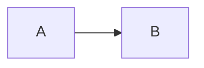

> This is the normative definition of TMark 0.1 (draft 4). The
> conformance suite is `spec/conformance/`; where a fixture and this text
> disagree, the text wins and the fixture is a bug, recorded in
> `design/12-spec-challenges.md` until one of them is fixed. Behaviour that
> needs a file, a process, a clock or the network is marked *(processor)*
> and is not part of the language (§@[sec:ir]). The history of the drafts
> is Appendix @[app:draft2], the open questions Appendix @[app:questions].

TMark is the Markdown dialect understood by TeXSmith. It is a curated,
opinionated stack: CommonMark structure, the Python-Markdown and PyMdownX
extension family that MkDocs users already know, and a small set of TeXSmith
constructs that close the gaps academic and technical writing actually has:
references, citations, numbering, captions, rich tables, and controlled
escape hatches to the backends.

Markdown was never designed for scientific documents. TMark does not try to
fix Markdown; it defines a *canonical subset with sugar*. Every feature has
exactly one canonical representation in the document model, and zero or more
sugar spellings that normalise to it. This is what makes linting, formatting
and round-tripping possible, and what keeps the syntax surface small even
though the feature list is long.

The specification is organised around the document model. §@[sec:model]
fixes the grammar families and the two sigils, §@[sec:conformance] the
conformance classes, §@[sec:front-matter] the front matter.
§@[sec:catalogue], the body of the spec, lists every node of the
intermediate representation with its canonical spelling, its accepted sugar,
its degradation class and its backend mapping. §@[sec:registries] describes
the registries the reference system draws on. Sugar that exists only for
compatibility with the PyMdownX world is confined to Appendix
@[app:pymdownx], and every deprecated spelling is dated in Appendix
@[app:deprecations].

This document is itself a TMark source and parses with `tmark check`. It
writes its captions *before* its tables, an accepted sugar (§@[sec:floats])
kept here so that a reader of the Markdown source meets the caption first;
`tmark fmt` would move them after.

## Philosophy {#sec:philosophy}

Six principles drive every decision below. They are referred to as P1 to P6.

P1, content not form
:   The body carries meaning; templates, fragments and the `press` section of
    the front matter carry appearance. TMark deliberately has no body syntax
    for font, size, colour, borders or highlight stripes. One bold, one
    emphasis, one small caps, and a template decides what they look like.
    When a document needs a new *kind* of thing (a "Finding", a "Solution"
    callout), it declares the kind under `declare:` and uses it semantically
    in the body. What the kind looks like is declared under `press:` or in
    the template.

P2, canonical form plus permissive input
:   TMark accepts the common spellings of the Markdown jungle (GFM tables,
    PyMdownX admonitions, Pandoc caption lines and citations) but defines,
    for each feature, a single canonical form. The formatter (`tmark fmt`)
    rewrites any accepted spelling to the canonical one. Sugar is for
    fingers; canonical is for tools.

P3, graceful degradation
:   A TMark file pasted into GitHub or any CommonMark renderer should stay
    readable. Every construct is classified (§@[sec:conformance]) by what a
    foreign renderer shows. Meaning changes are few, deliberate, and listed
    exhaustively.

P4, explicit over magic
:   No network fetches, no implicit content generation, no silent promotion
    of one construct into another unless the feature is named and switched
    on. Every such behaviour has an entry in the feature registry
    (§@[sec:features]) and an explicit canonical spelling that does not
    depend on the switch. Diagnostics are loud: an unresolved reference
    renders visibly as `[?key]`, never silently disappears.

P5, backend symmetry
:   Every construct must be expressible in LaTeX, Typst and HTML. A construct
    that only one backend can honour belongs in a raw passthrough, not in
    TMark proper.

P6, one mechanism per job, one spelling per mechanism
:   Where TeXSmith historically grew two spellings, two positions or two
    registries for one feature, this spec picks one and demotes the other to
    a compatibility alias with a deprecation horizon (Appendix
    @[app:deprecations]). Every sugar has a row there, with a horizon of
    `fmt` or `indefinite`: no sugar is accepted without one, and a
    formatter that can rewrite a spelling removes the last reason to keep
    accepting it.

## Document model {#sec:model}

### The IR is the definition {#sec:ir}

A TMark document is front matter (YAML) plus a body. The body parses into a
typed intermediate representation (IR); backends render the IR. The IR, not
any concrete syntax, is the definition of TMark. The canonical serialization
of the IR back to TMark text is the *normal form*. `tmark fmt` emits it,
and round-tripping means `parse → IR → print → parse` is a fixed point.
§@[sec:catalogue] is therefore both the syntax reference and the printer
specification: for every node it states what the printer emits (canonical)
and what the parser additionally accepts (sugar). The nodes, their names
and their fields are defined once, by the IR schema (`tmark schema ir`,
design 03); the catalogue describes them and never contradicts it.

Some behaviours this document describes need a file, a process, a clock or
the network: converting a diagram source, executing a `python image` fence,
fetching a DOI record, reading a `.bib` file, publishing a cross-document
inventory, resolving `date: commit`. They are marked *(processor)*. The
language records the *request* in the IR (an `Image` whose source is a
`.mmd` file, a `CodeBlock` whose node word is `image`, a
`sources.bibliography` entry) and a processor fulfils it; the reference
implementation (`tmark`) never performs them itself, and a conformant
processor may decline any of them with a diagnostic. Everything not so
marked is the language.

### Round-trip and source spans {#sec:roundtrip}

"The IR is the definition" only means something if the IR can be turned
back into text. Three guarantees make it operational.

Normal form is a fixed point
:   `parse(print(ir))` equals `ir`, modulo source spans. The printer emits
    exactly one spelling per node (the "Canonical" column of
    §@[sec:catalogue]), so printing is deterministic and `tmark fmt` is
    idempotent: formatting a formatted document is a no-op.

Every node carries a source span
:   File, line, column and byte range of the text it was parsed from,
    including the sugar that produced it. Spans are what a backend needs to
    report a LaTeX or Typst error against the Markdown line that caused it
    (the LaTeX writer emits line markers, the HTML writer `data-src`
    attributes), what an editor needs for outline, hover and go-to-target,
    and what SyncTeX-style navigation from PDF to source is built on.

    Some inline content is parsed out of a string the tokenizer hands over
    whole: the title of an admonition (`!!! note "…"`, `{title="…"}`), an
    image's alternative text, a cell of a `yaml table`. Where that string
    is a verbatim slice of the file, its nodes carry spans of that slice,
    like any other node. Where it is not — a quoted value with an escape in
    it, a YAML scalar the payload folds or spells twice — it has no source
    of its own, and every node parsed from it carries the span of the
    *construct* it came from: the whole marker line, the whole fence. A
    tool reading the file at those spans then finds the construct, not the
    node, and prints the node rather than splicing it.

Edits are local
:   A tool that changes one node (rename a label, rewrite a citation, add
    an attribute) prints that node and splices it into its span. Every
    other byte of the file is untouched. This is how refactoring tools
    avoid a lossless concrete syntax tree: the IR stays an abstract tree,
    and locality plus spans give byte-identical round-trips for everything
    the tool did not touch.

What the canonical printer normalises, and therefore what a full reprint
loses: the choice of sugar, fence lengths and marker characters, attribute
order (`#id`, then `.class`, then keys in source order), redundant
whitespace, the position of a caption line, and the spelling of an escape
or an entity (below). What it never loses: soft line breaks inside
paragraphs (a `SoftBreak` is a node, so prose is not re-wrapped and diffs
stay minimal), comments (§@[sec:structure]), raw passthroughs, and text
that looked like syntax but was not recognised (an unknown role name is
`Str`, printed as typed). The front matter is copied byte for byte: YAML
comments and key order survive because the printer does not re-serialise
it.

A `Str` holds decoded text: every backslash escape and every entity of the
source is resolved by the tokenizer, and `&nbsp;` is the character U+00A0
in the IR. The printer therefore re-escapes, in the position it prints a
run, the first character of anything a recogniser of §@[sec:grammar] or of
Appendix @[app:pymdownx] would otherwise match, and nothing else: `\@`
before a key, `\#` before `[`, `(` or `{`, `\{` before a role or attribute
head, `\[` before `^`, `@` or `=` and inside a role group, `\]` before
`(`, `{`, `[` or `:`, `\^`, `\~`, `` \` ``, `\$`, a `\=` or `\+` in a
run of two, `\<` before a tag, `\&` before an entity name, `\|` in a
cell, the CommonMark block starts (`\#`, `\>`, `\-`, `\1.`, `\!!!`,
`\:::`, `\---`), and `Table\:`, `Figure\:`, `Listing\:` at the start of
a paragraph so that prose never becomes a caption. All of them are ASCII
punctuation, hence ordinary CommonMark escapes: a foreign renderer shows
the character. An entity is printed as its character, never re-encoded,
which is the one normalisation of text the printer performs (challenge
C22); an author who needs the entity spelling on GitHub keeps it in a
code span.

Backends are one-directional. LaTeX or HTML output cannot be turned back
into the document that produced it, and the spec does not pretend
otherwise. The import direction is the HTML *reader*: a MkDocs page or a
foreign dialect enters as HTML, becomes IR, and the TMark printer writes it
in normal form. The printer is therefore just one more writer, and TMark
is one of its own backends.

### Four syntactic families {#sec:families}

Beyond core CommonMark structure (headings, paragraphs, lists, quotes,
emphasis, links, images, fenced code), TMark adds exactly four syntactic
families. Every construct in §@[sec:catalogue] is an instance of one of
them.

#### Attributes

Attributes decorate an existing node. They are written in braces *after*
the element they attach to:

```md
## Boot sequence {#sec:boot}
{width=60%}
```

Grammar: `{` followed by one or more `#id`, `.class`, `key=value` items
separated by spaces, then `}` (§@[sec:grammar] has the recogniser; the id
is an *identifier* of §@[sec:identifiers]). Values containing spaces are
double-quoted. There are no bare-word attributes: `{collapsed}` is not an
attribute list (write `{collapsed=true}`), and neither is `{}`: both stay
literal text. This restriction is what makes attributes and roles disjoint
grammars (see below). Python-Markdown's `attr_list` puts a colon right
after the brace (`{: .thin #id}`); that spelling is accepted on every host
as sugar and deprecated (Appendix @[app:deprecations]), and the printer
drops the colon.

#### Roles

Roles create semantic inline nodes. The name comes *before* the content:

```md
{index}[endianness]   {aside}[see Prandtl 1921]   {raw latex}(\clearpage)   {include}(chapter.md)
```

Grammar: `{` name, an optional single positional argument, any number of
`key=value` arguments, `}`, immediately followed by the content in brackets
or the argument in parentheses. The name is a bare identifier
(`[A-Za-z][A-Za-z0-9_-]*`) drawn from the closed role registry of
§@[sec:catalogue]; an unknown name is literal text. The positional argument
is sugar for the role's principal key: `{aside left}` is
`{aside side=left}`, `{code py}` is `{code lang=py}`, `{raw latex}` is
`{raw backend=latex}`. There is no other micro-syntax inside a role head, in
particular no `name:arg` form.

Brackets and parentheses follow the rule Markdown links already apply in
`[content](argument)`: brackets hold *content*, parsed as Markdown and
reaching the reader; parentheses hold a verbatim *argument* the processor
consumes. `{aside}[see **Prandtl**]` and `{index}[…]` take content;
`{raw latex}(\textbf{x})`, `{include}(chapter.md)` and `{counter}(fw:x)`
take arguments, and nothing inside the parentheses is ever interpreted as
Markdown. Each role accepts one form or the other, never both; the `index`
role accepts several bracket groups, for nesting. Parentheses nest when
balanced, as in link destinations; an unbalanced parenthesis has no escape
inside an argument, so a raw payload holding one is not representable
inline and is written as a fence (challenge C26). The reader's intuition
"brackets are visible, parentheses are not" is a good approximation of the
rule and the reason for it.

Content is inline Markdown, except for the two roles the registry marks
*verbatim*, `code` and `keys`, whose content is a string taken as typed
(`{code py}[a*b*]` holds `a*b*`). Brackets nest inside content when they
balance: `{aside}[see [x](u)]` holds a link. An unbalanced bracket is
written `\[` or `\]`, the ordinary CommonMark escape, which yields the
literal character and is not re-read as markup: `{aside}[\[x\](u)]`
holds the text `[x](u)`.

Roles and attributes are disjoint by construction, not by heuristic. An
attribute list begins with `#`, `.` or `key=`; a role head begins with a bare
identifier. A parser decides after reading one token. The additional
requirement that a role head be immediately followed by `[` or `(` exists
only so that a brace group which is neither (`{foo}` in running text) stays
literal.

Attributes need a host. Table @[tbl:hosts] is the complete list of hosts
and of where each takes its list; nothing else is a host. In particular a
paragraph, a list, a link, a code span and a role are not: a role carries
its own `key=value` arguments in its head, and a phrase that needs an
attribute is wrapped in the anonymous span. Nothing may separate an inline
host from its list: `[x] {#id}` and ` {#id}` are the host
followed by text. An attribute list with no host is literal text and the
warning `attr-no-host`.

Table: The attribute hosts and the position of the list. {#tbl:hosts}

| Host | Position of `{…}` |
| ---- | ----------------- |
| heading | at the end of the heading line |
| image | immediately after the closing `)` |
| anonymous span `[text]{attrs}` | immediately after the closing `]` |
| progress bar `[=45% "x"]{attrs}` | immediately after the closing `]` |
| fenced block (code, data directive) | at the end of the info string, in braces |
| container | on the opening fence, after the name |
| display math | after the closing `$$`, on the same line |
| caption line, and through it the table, figure or listing it captions | at the end of the line |
| block quote | a line holding only the list, closing the quote's last paragraph (`> {.epigraph}`) |

The anonymous span, written Pandoc-style as `[text]{attrs}`, exists for
attributes that are properties of a piece of text rather than a new kind of
node: an anchor on a phrase (`[this claim]{#claim-one}`), the language of a
quotation (`[this taylor]{lang=en}`), or media restriction
(`[web only]{media=web}`). A span with no attributes is just brackets, as
in CommonMark. An *empty* link hugging an attribute list (`[](){#id}`, the
MkDocs/autorefs anchor idiom) is the same anchor written the long way: an
empty link is no link, so it reads as the span and is deprecated in favour
of it (Appendix @[app:deprecations]).

Three attributes are universal, accepted on every host:

`#id`
:   An anchor (§@[sec:references]).

`lang=`
:   The language of the element, for hyphenation, quotes and typographic
    spacing. The document default is the root `lang:` metadata key.

`media=`
:   Where the element is rendered: `all` (default), `print` or `web`. A
    word (in a span), a code block, a callout, an image or a video
    restricted to one medium is the escape hatch of P5 when symmetry is
    impossible, and it replaces mirrored `latex raw` and `html raw`
    blocks. Nothing is conditional unless it says so.

Zero-width nodes (comments, index entries, anchors on their own, counter
definitions that print nothing, asides in the flow) take no space in the
text: whitespace on both sides collapses to a single space, and disappears
before punctuation. `Je suis un chien {aside}[remarque].` renders as
"Je suis un chien." with the aside attached to the preceding word. The
language's own punctuation spacing (the narrow no-break space before `:` in
French) is applied afterwards by the backend, not by this rule.

#### Container directives

Containers hold Markdown:

```md
::: figure {cols=2}
...markdown content...
:::
```

Grammar: `:::` name, an optional attribute list, content, closing `:::`.
Nesting is by fence length (`::::` outside `:::`), as in Pandoc and
markdown-it-container. `:::` is the canonical fence for every container,
as in Pandoc, Djot, MyST and markdown-it-container. The
PyMdownX spellings `!!! type "Title"` and `??? type "Title"` remain accepted
sugar for callouts only, because MkDocs Material renders them natively
(§@[sec:containers]). The PyMdownX block fence `/// name … ///` is
deprecated (Appendix @[app:deprecations]).

#### Data directives

Data directives hold non-Markdown content in a fenced *code* block whose
info string is `<lang> <node>`. The second word names the IR node the fence
produces; it defaults to `code`, so an ordinary fenced code block is the
degenerate case of the family. The same Python source is a listing or a
figure depending on that one word:

````md
```python
import matplotlib.pyplot as plt          # a CodeBlock: shown as a listing
plt.plot([1, 2, 4, 8])
```

```python image
import matplotlib.pyplot as plt          # an Image: executed, output embedded
plt.plot([1, 2, 4, 8])
plt.savefig("out.pdf")
```

```yaml table
columns: [A, B]                          # a Table
rows: [[1, 2]]
```
````

Node words: `code` (default), `table`, `table-config`, `image`, `raw`.
`yaml table`, `grid table`, `python image`, `mermaid image`, `latex raw` are
the instances this spec defines. The word names the node produced, never an
action (`render`, `exec`). One language has a different default: a bare
`mermaid` fence produces an image, because that is what MkDocs Material and
every Mermaid-aware renderer do with it; `mermaid code` restores the listing.
Degradation is excellent: any other renderer shows a plain code block.

The split between containers and data directives is a rule, not an accident:
containers hold Markdown, fences hold data. A figure group is a container; a
table description, a diagram source or a raw LaTeX payload is data.

Headings, lists and paragraphs are *not* re-expressible as roles or
directives. CommonMark structure is the substrate; the four families extend
it. (MyST and reST make the same choice: nobody writes headings as
directives.)

### Two sigils {#sec:sigils}

TMark reserves two inline sigils, each with exactly one meaning and exactly
two bracketings (Table @[tbl:sigils]).

Table: The two sigils and their bracketings. {#tbl:sigils}

| Sigil | Meaning | In braces (attribute) | Standalone (sugar for a role) |
| ----- | ------- | --------------------- | ----------------------------- |
| `#`   | define | `{#id}` names an existing host element | `#[term]` creates an index entry (content), `#(fw:key)` a counter item (argument) |
| `@`   | refer  | (none) | `@key` bare, `@[key …]` bracketed |

"`#` defines, `@` refers" is the mnemonic the whole reference system hangs
on. The forms are not redundant: an attribute needs a host element (a heading,
an image, a caption line, a span), whereas an index entry or a numbered
finding in a table cell has none. Among the standalone forms, the bracket
rule of §@[sec:families] does the routing: an index term is content
(`#[byte order]`), a counter key is an argument (`#(fw:boot-loop)`), so the
parser never has to consult a registry to tell them apart. The standalone
forms are sugar: the canonical spellings are the roles `{index}[…]` and
`{counter}(…)` of §@[sec:catalogue], which the printer emits (challenge
C6). `#{prefix:key}`, draft 2's counter marker and TeXSmith 0.6's
spelling, is in one state: deprecated sugar for `#(prefix:key)`, horizon
`fmt` (Appendix @[app:deprecations]), recognised only when `prefix` is a
declared counter, so that a Ruby-style `#{user.name}` in prose stays
literal (challenge C16). `#(…)` is the form with a rule behind it.

`^` is no longer a sigil. It appears in `[^1]` (footnote, CommonMark
convention) and `^x^` (superscript, PyMdownX convention) with unrelated
meanings; pretending it means "note" made the table lie.

### Registries {#sec:lookup}

`@` resolves against the registries of §@[sec:registries], in one order,
stated here and referred to from everywhere else:

1. *Cross-document aliases.* A key whose first segment is an alias of
   `sources.crossrefs` (`@fwrev:fw:x`) is looked up in that inventory and
   nowhere else (§@[sec:crossrefs]).
2. *The two predeclared lookups.* `@doi:…` is a DOI cited in place;
   `@gls:term` is a glossary term (§@[sec:glossary]).
3. *Labels.* Every id an attribute list defines on a host, every counter
   item, every implicit heading id (§@[sec:structure]), whatever the host:
   a key with no colon (`@stock`, `@boot-sequence`, `@top`) is looked up
   here, and so is a key whose head is a declared counter prefix
   (`@fig:trace`, `@fw:boot-loop`).
4. *The bibliography.* Any key.

A key found both as a label and as a bibliography key is `ref-ambiguous`;
a key found nowhere is `ref-unresolved`. A key with a colon whose head is
neither an alias nor a declared prefix is a bibliography key only
(BibTeX keys such as `knuth:1984` are common), so an anchor written
`{#claim:one}` on a span cannot be reached with `@`: a colon in an id
reserves its head for a declared prefix, and an anchor on a span, a
container or any host with no series of its own takes a plain id
(`{#claim-one}`) (challenge C24). `#(fw:boot-loop)` is routed by its
prefix to a declared counter and is `prefix-unknown` otherwise. Resolution
is a registry lookup, not a spelling: the prefix table in §@[sec:counters]
and the front matter's `declare` and `sources` are the single source of
truth.

### Lexical grammar {#sec:grammar}

The patterns below are the normative recognisers for the four families and
the two sigils, as PCRE. They are what an editor grammar or a linter needs;
the prose in the rest of the spec explains them. Named groups are the
fields the IR receives; `(?&name)` reuses a production defined once.

#### Identifiers {#sec:identifiers}

Every id, key and prefix in the language is built from three productions,
defined here and cited by name everywhere else:

```text
(?(DEFINE)
  (?<prefix>[A-Za-z][\w-]*)
  (?<key>[A-Za-z0-9][\w.-]*)
  (?<id>(?&prefix)(?::(?&key))+|(?&key))
  (?<doi>doi:[^\s\[\]()<>]*[^\s\[\]()<>.,;:!?])
)
```

`prefix`
:   The head of a series or a registry: a counter prefix (§@[sec:counters]),
    a cross-document alias, `gls`, `doi`. Letters, digits, `_` and `-`,
    starting with a letter; matched case-insensitively.

`key`
:   One segment: the key of a label, a counter item or a bibliography
    entry. Letters, digits, `_`, `.` and `-`, starting with a letter or a
    digit (Zotero's `1RgTv` is a key). An all-digit key is never a
    reference: `[^1]` is a footnote.

`id`
:   What `{#…}` defines and `@` refers to: a bare `key`, or a `prefix`
    followed by one or more `:key` segments (`fig:trace`; `fwrev:fw:x` for
    a cross-document reference). A counter item's key is one segment.

`doi`
:   The exception for a DOI cited in place: after `doi:` any run without
    whitespace or brackets, ending on a character that is not sentence
    punctuation, since a DOI holds `/` and `()` (challenge C3).

A key ends on a letter or a digit when it is read from running text, so
that sentence punctuation stays out (`@sec:intro.` refers to `sec:intro`).
A bare `@` reference requires its first character to be a letter, so that
`@1` stays text; a digit-initial key is written bracketed, `@[1RgTv]`,
`@[1RgTv, p. 3]`, which is what the printer emits for it (challenge C27).

#### Recognisers

Attribute list (family 1), after a host element (Table @[tbl:hosts]):

```text
(?<attrs>\{(?:\s*(?:#(?<id>(?&id))|\.(?<class>[\w-]+)|(?<key>[\w-]+)=(?<value>"(?:[^"\\]|\\.)*"|[^\s}]+)))+\s*\})
```

Inside a quoted value `\"` stands for a quote and `\\` for a backslash;
any other backslash is literal. A bare value ends at whitespace or `}`
(challenge C1). The deprecated Python-Markdown form is the same pattern
with `\{:?` in place of `\{`.

Role (family 2); the head must be followed immediately by bracketed
content (one group, or up to three for `index`) or by a parenthesised
verbatim argument (balanced parentheses allowed inside); content nests
balanced brackets and takes `\[`, `\]` as escapes (§@[sec:families]):

```text
\{(?<name>(?&prefix))(?:\s+(?<positional>[^\s=}]+))?(?:\s+(?<key>[\w-]+)=(?<value>"(?:[^"\\]|\\.)*"|[^\s}]+))*\}
(?:(?:\[(?<content>(?:[^\[\]\\]|\\.|\[(?&content)\])*)\])+|\((?<argument>(?:[^()]|\((?&argument)\))*)\))
```

Anonymous span, a host for attributes only:

```text
\[(?<text>(?:[^\[\]\\]|\\.)+)\](?=\{)
```

The two grammars are disjoint: after the opening brace an attribute list
continues with `#`, `.` or `key=`, a role head with a bare identifier.

Container fence (family 3), opening and closing lines:

```text
^(?<fence>:{3,})\s*(?<name>(?&prefix))(?:\s+(?&attrs))?\s*$
^(?<fence>:{3,})\s*$
```

A dotted name is not a container but a foreign directive
(§@[sec:structure]); it has no closing line and its body is the indented
lines that follow:

```text
^:{3,}\s*(?<directive>[A-Za-z][\w-]*(?:\.[\w-]+)+)\s*$
```

Data directive info string (family 4), on the opening code fence: the
language, an optional node word, bare `key=value` options, and an optional
attribute list in braces at the end, the only spelling that carries
classes and an id (challenge C28). Its classes, id and pairs land in the
fence's options (on a `mermaid` fence, on the generated image's
attributes); the printer keeps the braces when there is a class or an id
and writes bare `key=value` pairs otherwise:

```text
^(?<lang>[\w+-]+)(?:\s+(?<node>code|table|table-config|image|raw))?(?<options>(?:\s+[\w-]+=(?:"(?:[^"\\]|\\.)*"|[^\s}]+))*)(?:\s+(?&attrs))?\s*$
```

`pymdownx.superfences` also spells the whole info string as one
`attr_list` group, with no bare word before it — `{ .c .annotate }`, the
form MkDocs Material documents for code annotations, and `{.c
.annotate}` without the inner spaces. It is accepted (class E, Appendix
@[app:pymdownx]) and means exactly what the first grammar does: the
**first class is the language**, the rest of the list is the fence's
options, and there is no node word. A processor never reports a language
of `{`:

```text
^(?&attrs)\s*$
```

The canonical spelling is the first grammar, so the braces-only form is
deprecated (Appendix @[app:deprecations]) and `fmt` rewrites `{ .c
.annotate }` to `c {.annotate}`, which Material renders identically.

Bare reference or citation (`@` refers). The look-behind is the X4 guard:
no `@` inside a word, an e-mail address or a URL; the key is an `id` that
starts with a letter and ends on a letter or a digit
(§@[sec:identifiers]), or a `doi`:

```text
(?<![\w@/:.-])@(?<key>(?&doi)|(?=[A-Za-z])(?&id)(?<=[A-Za-z0-9]))
```

Bracketed reference or citation, the form that holds what a bare key
cannot: a locator, a suffix, several keys, a flag, a digit-initial key.
One or more items separated by `;`, each an optional prefix text, an
optional flag (`-` suppresses the author, `+` makes the item narrative,
§@[sec:references]), the key — the last word before the first `,` — and an
optional suffix or locator after that comma (Pandoc's item grammar):

```text
(?<![\w@/:.-])@\[(?<item>[^\[\];,]*?[-+]?(?<key>(?&doi)|(?&id)(?<=[A-Za-z0-9]))(?:,[^\[\];]*)?)(?:;(?&item))*\]
```

Standalone definitions (`#` defines): an index entry with one to three
bracket groups, a counter item with one parenthesised `prefix:key`;
`\#` escapes:

```text
(?<!\\)#\[(?<term>[^\[\]]+)\](?:\[(?<sub>[^\[\]]+)\]){0,2}
(?<!\\)#\((?<prefix>(?&prefix)):(?<key>(?&key))\)
```

Caption line, a paragraph of its own adjacent to the float, ending in an
optional attribute list (the universal `lang=` and `media=` included,
challenge C23):

```text
^(?<kind>Table|Figure|Listing):\s+(?<text>.*?)(?:\s*(?&attrs))?\s*$
```

Escapes: `\@`, `\#`, and any backslash-escaped bracket inside role
content; §@[sec:roundtrip] lists what the printer escapes. Inside code
spans and fenced blocks none of the patterns fire.

## Conformance and deviations {#sec:conformance}

Every construct carries a degradation class, which says what a renderer
other than TeXSmith shows for the same bytes.

C, compatible
:   Renders identically in CommonMark and GFM.

E, extension-compatible
:   Not CommonMark, but renders identically under the standard extension set
    of Table @[tbl:extensions], which is what MkDocs, MkDocs Material, Zensical
    and any Python-Markdown site already load. The extensions in that set are
    mutually compatible and TMark never redefines what they do.

D, degrades
:   Foreign renderers show something readable but unstyled: a code block, a
    literal `!!! note` line, a `Table:` paragraph.

X, diverges
:   The same bytes *mean something else* in GFM. These are the dangerous
    ones; Table @[tbl:deviations] is exhaustive and normative.

Table: The standard extension set that defines class E. {#tbl:extensions}

| Package | Extensions | Constructs |
| ------- | ---------- | ---------- |
| Python-Markdown | `extra` (`abbr`, `attr_list`, `def_list`, `fenced_code`, `footnotes`, `md_in_html`, `tables`), `admonition`, `toc` | acronyms, attributes, definition lists, footnotes, pipe tables, `!!!` callouts, `<div markdown>`, `[TOC]` |
| PyMdownX | `superfences`, `highlight`, `inlinehilite`, `snippets`, `arithmatex` | nested fences, code options, `#!lang` inline code, includes, math |
| PyMdownX | `caret`, `tilde`, `mark`, `keys`, `betterem`, `smartsymbols`, `emoji`, `magiclink`, `critic` | `^x^`, `~x~`, `==x==`, `++ctrl+s++`, smart symbols, emoji, bare URLs, critic markup |
| PyMdownX | `details`, `tasklist`, `fancylists`, `progressbar`, `tabbed` | `???` callouts, task items, list markers, progress bars, tabs |

Table: Class X deviations from GFM. {#tbl:deviations}

| # | Syntax | GFM meaning | TMark meaning | Rationale |
| - | ------ | ----------- | ------------- | --------- |
| X1 | `__text__` | bold | small caps | `__` duplicates `**`; academic writing needs small caps far more than a second bold. Visible, not silent: small caps look nothing like bold. Disabled by the `strict` profile. |
| X2 | `---` (thematic break) | horizontal rule | page break (paged media) at the top level, separator in a container | See §@[sec:structure]. Semantically it stays a divider; at the top level of the document the paged writers emit `\tsdivider` / `#ts-divider()`, a page break unless the template redefines it, and the web shows `<hr>`. Inside a container the same node is `\tsrule` / `#ts-rule()` / `<hr class="rule">`, a separator that never breaks the page. Disabled by the `strict` profile. |
| X3 | `~x~` | strikethrough (single tilde) | subscript | PyMdownX tilde, long-established in the MkDocs world; the only class-E construct GFM assigns a different meaning to. |
| X4 | `@word` | literal | reference or citation | Guarded: never fires inside e-mails, URLs, or code; `\@` escapes. Identical to Pandoc's behaviour with `--citeproc`. |
| X5 | `#[…]`, `#(…)` | literal | index entry, counter item | `#[` or `#(` followed by a non-space never occurs in prose; `\#` escapes. The deprecated `#{prefix:key}` fires only for a declared prefix (§@[sec:sigils]). |

A conformant TMark processor MUST implement classes C, E and D and MUST
document which X-deviations are active.

### Profiles {#sec:profiles}

A *profile* selects which deviations and which sugar are active, at parse
time, and which spelling the printer emits. There are three (Table
@[tbl:profiles]); every other mention of a profile in this document refers
to this table.

Table: The profiles. {#tbl:profiles}

| Profile | Parses | Prints |
| ------- | ------ | ------ |
| `canonical` (default) | everything in this document and in Appendix @[app:pymdownx]; X1–X5 active | the normal form |
| `strict` | X1, X3 and critic markup (Appendix @[app:pymdownx]) are off: `__x__` is strong, `~x~` and `{++x++}` are literal text; X2, X4 and X5 stay, since `---` is a divider in GFM too and `@`/`#` are guarded | the normal form |
| `mkdocs` | as `canonical` | the PyMdownX and TeXSmith 0.6 spelling of every construct that has one (`!!!`, `--8<--`, `[^key]`, `<div markdown>`, …), the normal form otherwise (design 04) |

A profile changes no feature default (Table @[tbl:features]); `features:`
does. `tmark fmt --profile` translates between profiles, and the
translation is lossless because every sugar has a canonical form that is
class C, E or D. `strict` serves teams that co-render their sources on
GitHub; whether X3 should stay on under it is open question 2.

## Front matter {#sec:front-matter}

YAML island at line 1, fenced by `---`. A TMark file is a `.md` file, so
that it renders on GitHub (P3); `.tm`, `.tmd` and `.tmark` are accepted as
explicit markers of the dialect (ADR 0006).

`press` is a namespace, not a category. Every key TMark reads (Table
@[tbl:keys-meta] and Table @[tbl:keys-press]) may sit at the root of the
front matter or under `press:`; when the same key appears in both places,
`press` wins, per key, the root value being dropped rather than merged.
The namespace is optional and exists for one reason: a Markdown file is
often shared with a static site generator whose own front matter schema
owns the root (MkDocs, Hugo, Jekyll, Zensical). Moving the TMark keys
under `press` keeps them out of that generator's way without changing
their meaning. A document that only TeXSmith reads may put everything at
the root.

Table: The metadata keys, read by TMark. {#tbl:keys-meta}

| Key | Type | Default | Meaning |
| --- | ---- | ------- | ------- |
| `title` | string or `null` | absent | The document title. Absent: the first heading is promoted *(processor)*; `null`: no promotion and no title. |
| `subtitle` | string | absent | |
| `authors` | list of `{name, affiliation, email}`; a bare string is a name | absent | |
| `date` | ISO date, free text, or `commit` | absent | `commit` is resolved by the processor from the repository *(processor)*; TMark keeps it as written. |
| `id` | string | absent | Document identifier, the head of every key the document publishes for cross-document references. |
| `lang` | BCP 47 tag (`fr`, `en-GB`) | template's | Document language: hyphenation, quotes, list-of-figures words, typographic spacing. |
| `epigraph` | `{quote, source}` | absent | The document's epigraph, `quote` and `source` as plain text. TMark types the key and renders nothing from it: where an epigraph is set on a page is the consumer's decision, and a consumer that has made it splices a `> {.epigraph}` quote (§BlockQuote). |

Table: The `press` groups, and who reads them. {#tbl:keys-press}

| Key | Type | Default | Read by |
| --- | ---- | ------- | ------- |
| `base_level` | `chapter`, `section`, … | template's | TMark, TeXSmith: what a top-level `#` maps to |
| `declare.counters` | map of prefix to counter fields (§@[sec:counters]) | `{}` | TMark |
| `declare.admonitions` | map of type to `{name, group, reference, counter}` (§@[sec:containers]) | `{}` | TMark |
| `declare.glossary` | flat or structured (§@[sec:glossary]) | `{}` | TMark |
| `declare.acronyms` | map of acronym to expansion | `{}` | TMark |
| `sources.bibliography` | map of key to DOI URL or entry fields, or a list of `.bib` paths (§@[sec:bibliography]) | `{}` | TMark |
| `sources.crossrefs` | map of alias to inventory path (§@[sec:crossrefs]) | `{}` | TMark |
| `features` | map of feature name to boolean (Table @[tbl:features]) | the table's defaults | TMark |
| `template` | string | `article` | TeXSmith |
| `toc` | boolean | template's | TeXSmith |
| `slots` | map of slot name to label or `{label, flatten}` | template's | TeXSmith |
| `numbered` | boolean | `true` | TeXSmith: the document-level heading numbering default (§@[sec:structure]) |
| `callouts.style` | `fancy`, `classic`, `minimal` | `fancy` | TeXSmith |
| `callouts.<type>` | `{icon, color}` | template's | TeXSmith |
| `details` | `expand`, `reference` | `expand` | TeXSmith (§@[sec:containers]) |
| `code.engine` | `pygments`, `listings`, `verbatim`, `minted` | `pygments` | TeXSmith |
| `code.inline` | `{breaks: boolean}` | `{breaks: false}` | TeXSmith |
| `aside` | `left`, `right`, `outer`, `inner` | template's | TeXSmith (§@[sec:notes]) |
| `comments` | `strip`, `keep` | `strip` | TeXSmith (§@[sec:structure]) |
| `refs.textual` | `{print, web}` format strings | `{print: "{text} ({number})", web: "{text}"}` | TeXSmith (§@[sec:references]) |

The form keys of the second half are TeXSmith's: TMark preserves them and
never reads them, and the list is what this document cites, not the whole
of TeXSmith's schema. A `press` key that is a form key is also the place a
site plugin reads its own switches; none of them toggles a feature of Table
@[tbl:features].

Within the namespace, four groups; the draft-2 top-level keys remain
accepted with a deprecation warning (Appendix @[app:deprecations]):

```yaml
---
# Document metadata stays at the root: every other tool (MkDocs, Pandoc,
# editors) reads `title` and `date` there.
title: Firmware Review          # omitted → first heading is promoted
authors: [{name: Ada Lovelace, affiliation: Analytical Engine}]
date: 2025-03-15                # ISO date | string | "commit"
id: RHE-423                     # document identifier for cross-doc references
epigraph: {quote: …, source: …}

press:                          # optional namespace; every key below may sit at the root
  template: book                # form: article | book | letter | user template
  base_level: chapter           # what a top-level `#` maps to
  callouts:
    style: fancy                # fancy | classic | minimal
    solution: {icon: "🎓", color: "#123456"}   # styling of a declared kind
  details: expand               # expand | reference
  code: {engine: pygments, inline: {breaks: true}}
  slots: {abstract: Abstract}

  declare:                      # kinds: what things *are*
    counters: {…}
    admonitions: {…}
    glossary: {…}
    acronyms: {…}

  sources:                      # where references resolve
    bibliography: {…}
    crossrefs: {…}

  features:                     # the switch registry
    figures.exec: true
---
```

The groups are P1 applied to the front matter itself. `declare` says that a
"Solution" callout exists, belongs to the group "Solutions" and is referred
to as "See page N"; the form keys (`template`, `callouts`, `code`, …) say it
is blue with a graduation-cap icon. A document can be re-skinned by
replacing the form keys alone.

TMark validates the groups it reads and preserves every other key, byte
for byte, for the tool that owns it (challenge C9): an unknown key inside
`declare`, `sources` or `features` is the error `frontmatter-unknown-key`;
a YAML island that does not parse is `frontmatter-yaml`, and the document
is read as having no front matter. The draft-2 spellings of Appendix
@[app:deprecations] are read and reported as `deprecated-frontmatter-key`.

Any front-matter value is available in the body as a moustache, `{{ key }}`
or `{{ press.template }}`, resolved after Markdown parsing and never inside
code spans or fenced blocks. An unresolved moustache
warns and is left in place, visibly. Moustaches are substitution, not
templating: there is no logic, no loop, no filter, and the spec does not
intend to add any; a document that needs computation generates its
Markdown. Class C: a foreign renderer shows the moustache as typed.

The root `lang:` key (`fr`, `en-GB`, …) is the document language, used for
hyphenation, quotes, list-of-figures words and typographic spacing. Spacing
rules are applied by the backend from the language: the narrow no-break
space before `;`, `:`, `?`, `!` in French, the no-break space between a
number and a unit, and never by a construct in the body. `&nbsp;` is
accepted as an explicit override, class C. A passage in another language
is a span: `[this taylor]{lang=en}`.

## Node catalogue {#sec:catalogue}

Each entry follows the same shape: the canonical spelling (what `tmark fmt`
emits), the sugar the parser additionally accepts (each with its status in
Appendix @[app:deprecations]), the degradation class, and the backend mapping
(LaTeX, Typst, HTML). Node names are those of the IR schema
(`tmark schema ir`), which is also the normative list of every node's
fields; an entry names a field only when the text needs it. Where an entry
gives no backend mapping, the mapping is backend-defined: the writer
renders the node with the backend's native construct and no contract of
`ts-typesetting` is involved.

### Structure {#sec:structure}

#### Header

`#` to `######`, six levels, never manually numbered. Attributes at end of
line: `## Title {#sec:intro}`. Class C. Headings are relative
*(processor)*: the processor aligns multi-file hierarchies (per-fragment
offset from the shallowest heading, plus the template slot base, plus
`press.base_level`), and promotes the first heading to the document title
unless `title:` is declared (`title: null` opts out; TeXSmith's
`--no-promote-title` flag is the command-line spelling of the same). That
machinery is a processing concern, not syntax. Backends: `\section` and
friends, `= Heading`, `<h1>`.

Two classes are recognised on a heading, both Pandoc's: `.unnumbered` takes
the heading out of the numbering sequence (`\section*`, `numbering: none`,
`class="unnumbered"`), and `.unlisted` keeps it out of the table of
contents and, as in Pandoc, implies `.unnumbered`. Each applies to its own
heading only; the document-level
default is `press.numbered` (`true` by default), which a class overrides one
heading at a time. Pandoc's `{-}` shorthand is not an attribute list (there
are no bare-word attributes, §@[sec:families]) and stays literal text; the
Pandoc importer rewrites it. Class E.

A heading with no `{#id}` has an *implicit id*, so that the empty-link and
textual forms of §@[sec:references] (`[](#boot-sequence)`,
`[the boot sequence](#boot-sequence)`) resolve to it, as they do on GitHub
and on every Python-Markdown site. The rule is GitHub's: the plain text of
the heading (inline markup and code reduced to their text, zero-width nodes
and the attribute list removed), NFC-normalised and lower-cased, every
character that is not a letter, a digit, a combining mark, a space, `-` or
`_` removed, runs of spaces turned into one `-`; a duplicate gets `-1`,
`-2`, … in document order. Accents and non-Latin scripts survive, as on
GitHub and MkDocs Material; a site whose slugifier differs (Python-Markdown's
default `toc` drops accents) needs an explicit id, which is the
recommendation anyway. The implicit id is a label like any other
(`@boot-sequence` renders "section 2"), derived at resolution and never
stored in the IR or printed, so the round-trip is untouched; an explicit
`{#id}` replaces it, a heading having one id. Because an implicit id
changes whenever the title is edited, a reference to one is a lint hint
`ref-implicit-id` that suggests `{#id}`. Editors compute go-to-target with
the same function. The paged writers emit a label for an implicit id only
when it is referenced; the HTML writer emits none, since a site gives its
headings ids by its own slug rule, which is why a site whose rule is not
GitHub's needs the explicit id.

#### Para

CommonMark. A *lead-in* paragraph (a short run-in heading that opens a
paragraph) has an explicit role:

```md
{lead}[Boot sequence.] The device powers the flash before the SoC…
```

The role takes what follows it on the paragraph, whatever that is: the
lead-in is what the author wrote between the brackets.

Sugar: a paragraph whose *whole* content is a strong span shorter than 80
characters is promoted to a lead-in when feature `paragraph.lead` is on (on
by default, off under `strict`). A strong span that merely opens a
paragraph is a bold run-in and stays one — promoting it would move the rest
of the sentence into a paragraph of its own, since `\tslead` breaks the
paragraph around the lead-in. A list item is not promoted either: a
bold-only item is a label. The promotion is sugar, not magic: it is
named, switchable, and `tmark fmt` rewrites it to the role. Class C.
Backends: `\tslead{…}`, a bold run-in, `<p><strong class="lead">`.

#### BlockQuote

`>`; class C. The attribute list is a line of its own closing the quote
(Table @[tbl:hosts]); a quote tagged `{.epigraph}` renders as an epigraph
(`\tsepigraph`, `#ts-epigraph`, `<blockquote class="epigraph">` with the
`source` attribute in a `<footer>`), wherever the quote sits. The front-matter `epigraph:` key (Table @[tbl:keys-meta])
names the same thing in metadata — its `quote` and `source` are plain
text, not Markdown — and says nothing about where it goes: TMark types the
key, and a consumer that decides an epigraph belongs under the opening
heading, or on a title page, or nowhere, splices the quote there itself.
No writer reads the key.
Backends otherwise: `displayquote` (csquotes), `#quote(block: true)`,
`<blockquote>`.

#### BulletList, OrderedList

`-` and `1.`, nesting by indentation; `pymdownx.fancylists` markers are
accepted (Appendix @[app:pymdownx]). Task items `- [ ]` and `- [x]` are
class C; `- [.]` "partial" is class D, feature `tasklist.partial`, off by
default, literal text when off. Backends: `itemize` / `enumerate`, `-` /
`+` items, `<ul>` / `<ol>`; a task item is a checkbox in every backend.

#### DefinitionList

PHP-Markdown-Extra `def_list`, class E:

```md
Term
:   Definition, indented continuation lines aligned.
```

Backends: `description`, `/ Term: definition`, `<dl>`.

#### Comment

```md
<!-- Inline note to self, never rendered. -->

<!--
A block comment: alone on its lines, it is a block node.
-->
```

Canonical and only spelling: the HTML comment, inline or block. A comment
is a node, not something the parser drops: the printer re-emits it in
place, so `tmark fmt` never loses an author's note. The rendering default
is to strip it in every backend, with `press.comments: keep` emitting `%`
lines in LaTeX, `//` in Typst and an HTML comment on the web for debugging
builds. A comment has zero width in the flow: whitespace on both sides
collapses to one space and disappears before punctuation.

No other spelling qualifies, and the reason is P3 read strictly. The
degradation of a comment must be invisibility, and the HTML comment is the
one construct every Markdown renderer hides. A `::: comment` container or a
`{comment}(…)` role would display its content on GitHub, which for a
private note is worse than any unstyled fallback. Annotations meant to be
read by reviewers in a draft build (to-dos, change tracking) are not
comments: they are visible content in one rendering mode. Critic's
`{>>note<<}` is exactly that, so it holds this node inside the annotating
`Span{.critic}` of Appendix @[app:pymdownx] rather than standing as a bare
comment: the class is the separate node the previous sentence asks for.
Class C.

#### HorizontalRule

`---` on its own line, blank lines around, is a *divider* node
(`HorizontalRule`). The syntax keeps its CommonMark semantics ("section
divider"); what a divider looks like is form, so no writer chooses it
itself: at the top level of the document the LaTeX writer emits
`\tsdivider`, the Typst writer `#ts-divider()`, and the `ts-typesetting`
fragment defines both as a page break (`\clearpage`, `#pagebreak()`), which
a template redefines at will (a fleuron, a blank line, nothing). The HTML
writer emits `<hr>`: the web shows a rule and never a page break. The paged
default is the one opinionated part (X2).

A divider *inside a container* — a block quote, a callout, a figure, a
`:::` div or tab, a list item, a table cell, an aside, a footnote: anything
that is not the document's top-level block sequence — separates, it does
not page-break. Breaking the page there would tear the container in two,
and Typst refuses it outright ("pagebreaks are not allowed inside of
containers"). The writers know their own nesting and emit the second
contract of `ts-typesetting`: `\tsrule`, `#ts-rule()`, `<hr class="rule">`,
a full-width rule with the surrounding skips, restylable exactly like
`\tsdivider` and never a page break (challenge C48). One node, two
contracts; the author writes `---` in both places.

There is no line-break role: Markdown's hard break (trailing `\`) exists,
and a backend-specific break is a raw passthrough:
`{raw latex}(\newpage)`.

#### Foreign directive

Two spellings of the MkDocs world are directives for a processor other than
TMark: Python-Markdown's `[TOC]` paragraph, and a `:::` line whose name is
dotted (`::: texsmith.core.config`, mkdocstrings' syntax, its options in the
indented YAML that follows, no closing fence). TMark interprets neither:
each is a `RawBlock` with `format=markdown`, kept verbatim. The `[TOC]` form
is the paragraph alone; the dotted form is the `:::` line plus every
following line that is blank or indented by four spaces or more, so the
directive closes at the first dedent, and the fence rules of
§@[sec:families] (matching `:::`, `container-unknown`, `container-unclosed`)
do not apply to it. The printer emits the block as typed; the HTML writer
and the paged writers emit nothing: the table of contents in print is
`press.toc`, and an API reference has no print form. `[TOC]` is silent
(class E); a dotted directive is the lint hint `directive-foreign`, so that
a document meant for print does not lose a block without notice (class D).

### Inline text {#sec:inline}

Table @[tbl:inline] lists the inline nodes, their canonical spelling, their
sugar and their mapping. The class column is the class of the *canonical*
spelling; the class of a sugar is in the row of Appendix @[app:pymdownx]
or the deviation table that names it (`__x__` is X1, `~x~` is X3, the
rest of the PyMdownX sugar is E).

Table: Inline text nodes. {#tbl:inline}

| Node | Canonical | Sugar | Class | LaTeX / Typst / HTML |
| ---- | --------- | ----- | ----- | -------------------- |
| `Str`, `SoftBreak`, `LineBreak` | text, a newline inside a paragraph, `\` at the end of a line | two trailing spaces for the hard break | C | text |
| `Emph` | `*x*` | `_x_` | C | `\emph` / `_x_` / `<em>` |
| `Strong` | `**x**` | (none) | C | `\textbf` / `*x*` / `<strong>` |
| `SmallCaps` | `{sc}[x]` | `__x__` (X1) | D | `\textsc` / `smallcaps` / `font-variant` |
| `Strikeout` | `{del}[x]` | `~~x~~` | D | `\sout` / `strike` / `<del>` |
| `Underline` | `{underline}[x]` | `^^x^^` under `inline.insert` only | D | `\underline` / `underline` / `<u>` |
| `Highlight` | `{mark}[x]` | `==x==` | D | `\hl` / `highlight` / `<mark>` |
| `Subscript` | `{sub}[x]` | `~x~` (X3) | D | `\textsubscript` / `sub` / `<sub>` |
| `Superscript` | `{sup}[x]` | `^x^` | D | `\textsuperscript` / `super` / `<sup>` |
| `Keystroke` | `{keys}[ctrl+s]` (verbatim, keys split on `+`) | `++ctrl+s++` | D | ts-keystrokes / `kbd` / `<kbd>` |
| `Code` | `` `x` `` | (none) | C | engine-dependent |
| `Code` (highlighted) | `{code lang=py}[print(1)]`, positional `{code py}[…]` (verbatim) | `` `#!py print(1)` `` | D | engine-dependent |
| `Link` | `[text](url)`, `[text](#id)`, `[text][id]` (§Ref, reference-style), `<url>` | a bare URL (magic link, autolinked; the printer keeps it bare) | C | `\href` / `#link` / `<a>` |
| `Math` | `$x$` | `\(x\)` | C | `\(…\)` / `$x$` / MathJax |
| `Quoted` | `"x"` | (none; the pair is read by the smart-symbol rule, Appendix @[app:pymdownx]) | C | `\enquote` / smart quotes / locale quotes |
| `Abbr` | the acronym, with `*[HTML]: expansion` defined once (§@[sec:glossary]) | (none) | E | `\acrshort` / `#ts-abbr` / `<abbr>` |
| `Span` | `[x]{attrs}`; printed as the shortcode when the class is `icon` with `media=web` and the text is a shortcode, as critic markup when the class is `critic` (Appendix @[app:pymdownx]) | (none) | D | `\foreignlanguage`, anchor, media switch |

```yaml table-config
columns:
  - {width: 2.1cm}
  - {align: left, width: X}
  - {align: left, width: X}
  - {width: 1cm}
  - {align: left, width: X}
```

Underline has a role and no sugar, and the obvious sugar, `__x__`, goes to
small caps instead. The case for underline is visual: two underscores look
like an underline. The case for small caps is frequency and typography.
Academic and technical prose uses small caps constantly (author names in
citations, acronyms set as small caps, keywords in definitions) and
underline almost never: print typography treats it as a typewriter relic,
and every style guide recommends emphasis or small caps in its place. The
one construct that deserves a two-keystroke spelling is the frequent one.
Giving `__` to underline would also lower the cost of a construct the spec
does not want to encourage. The visual argument is real but it is the same
argument that gave Markdown `*` for emphasis, which does not look like
italics either. Draft 1 assigned `__` to underline; draft 2 reversed it to
match the implementation and the reasoning above. `^^x^^` (caret "insert") is not a TMark
construct: with the feature `inline.insert` off (the default) it is literal
text and `tmark lint` hints `feature-off`; on, it is sugar for
`{underline}[x]`, one node whatever the spelling, and the printer emits the
role (Appendix @[app:pymdownx]). Long inline code wraps per
`press.code.inline`.

`++x++` (keystroke) recognises prose as its off switch: the opening `++`
must not be preceded by a word character (letter, digit, or a character
`\w` would call a letter) and the closing `++` must not be followed by one,
and the text between the pair must be non-empty and hold no whitespace.
Without this, `C++03` and `i++` in ordinary prose read as a keystroke from
the first `++` to the next one, swallowing everything in between (challenge
C61). PyMdownX's `keys` extension is narrower still — the content is a
`+`-separated list of key tokens (`[A-Za-z0-9][A-Za-z0-9_-]*`) with no
spaces — but the two boundary conditions plus the no-whitespace rule are
what the tokenizer enforces; a per-token grammar is not.

#### Math (inline)

`$…$` canonical; `\(…\)` accepted as sugar (a LaTeX habit, class E under
`arithmatex`, literal elsewhere; Appendix @[app:deprecations]). Content is
LaTeX math (MathJax-compatible), the Typst backend translates it. No space
directly after the opening delimiter nor directly before the closing one,
PyMdownX's rule, so `$5 and $6` is prose. Class C for `$…$`: GitHub
renders it natively.

#### ProgressBar

```md
[=45% "Review"]
[=100% "Launch"]{.thin}
```

An inline node with a `value` (a number from 0 to 100, clamped) and an
optional `label` (plain text in double quotes; the percentage when absent).
Attributes attach as on any host (Table @[tbl:hosts]): `.thin` halves the
height; every class is forwarded to the print contract and to the web
stylesheet, and the print contract honours `thin` alone. A bar has no
counter and is not a reference target: its `#id` reaches the web element
only and defines no label. The spelling is
PyMdownX's and is the canonical one. Sugar: the fraction form
`[=9/20 "Review"]`, normalised to a percentage, and the Python-Markdown
attribute spelling `{: .thin}` (both deprecated, Appendix
@[app:deprecations]). PyMdownX registers the pattern inline and its
stylesheet displays the bar as a block; TMark keeps the node inline
(a bar fits a table cell), consecutive bars on separate lines are separate
paragraphs or hard-broken lines, and the template chooses the width. Class
E. Backends: `\tsprogress` (`ts-typesetting`, over the `progressbar`
package), `#ts-progress`, `<div class="progress">`. Recogniser, the
percentage form and the deprecated fraction (`0/0` is literal):

```text
\[=\s*(?:(?<value>\d+(?:\.\d+)?)%|(?<num>\d+)/(?<den>\d+))(?:\s+"(?<label>[^"]*)")?\s*\]
```

A backslash before the `[` keeps the whole spelling literal, label
included, and the printer writes it back (§@[sec:roundtrip]).

#### Emoji and icon shortcodes

An emoji shortcode `:smile:` is sugar for the character it names: the
tokenizer replaces it with a `Str` holding U+1F604, and the printer emits
the character. The name table is GitHub's (the `gemoji` short names, which
`pymdownx.emoji` ships as one of its indexes): a colon-delimited word that
is not in the table is literal text with no diagnostic, so `12:30:45` and
`a:b:c` are safe, and the closing colon must be followed by the end of the
run or a character that is not a letter or a digit, so `:smile:a` is text.
Nothing fires in code. Class E, and GitHub renders the
shortcodes too. How an emoji is set in print (a colour font, a monochrome
one, an image) is the template's business, not syntax.

An icon shortcode (`:material-cog:`, `:fontawesome-solid-check:`,
`:octicons-tag-16:`, `:simple-github:`) names an SVG of the MkDocs Material
theme, which no print backend and no icon-less site can honour (P5). It is
recognised by those four set prefixes and lowers to a web-only span,
`Span{.icon media=web}` holding the shortcode as its text, so the media rule
of §@[sec:families] removes it from print (the spaces around it collapse)
and the HTML writer emits `<span class="icon">:material-cog:</span>` for the
site's stylesheet or plugin to replace. The shortcode is its own canonical
spelling: the printer writes such a span back as the shortcode. `tmark
check` hints `icon-web-only` on every occurrence, so an author writing for
print knows the icon is not there. Class D. Icons are decoration; a symbol
that must reach print is an emoji or an image.

#### TeX logos

`TeX`, `LaTeX`, `LaTeX2e`, `XeTeX`, `XeLaTeX`, `LuaTeX`, `LuaLaTeX`,
`pdfTeX`, `pdfLaTeX`, `BibTeX`, `BibLaTeX` and `ConTeXt`, written as plain
words, are set as logos by the backends (`\LaTeX{}` and the
`ts-typesetting` logo macros, a Typst function, `<span class="tex-logo">`
with the raised and lowered letters). There is no node and no role: the
words are `Str` in the IR and print as typed. Like the language-driven
punctuation spacing of §@[sec:front-matter], the logo is a typographic
rule applied by the writer, form rather than content (P1). The rule is the
feature `typography.tex-logos`, on by default: it
matches whole words only, case-sensitively, and never inside code, math,
raw passthroughs, link destinations or attribute values. To print one of
these words literally, turn the feature off or put the word in a code span;
there is no per-word opt-out, on purpose.

### Notes {#sec:notes}

#### Note (footnote)

`[^1]` reference, `[^1]: text` definition; class C (GFM renders them).
Footnotes should stay one line in print. Pandoc's inline footnote
`^[text]` is not part of 0.1: the spelling is occupied by the deprecated
citation sugar until its horizon (Appendix @[app:deprecations]). Backends:
`\footnote`, `#footnote`, the GFM footnote list.

#### Aside

Inline role for a remark tangential to the flow:

```md
Hooke's law {aside}[linear only at small strain] holds below the yield point,
but non-linear effects {aside side=left}[see **Prandtl 1921**] dominate above it.
```

The node is named for what it is, not where it goes (P1): the print
templates put asides in the margin, a web template may render a sidebar or
a collapsed note. `side=left|right|outer|inner` is a layout hint of the
same standing as `width=` on an image, with the default in `press.aside`.
The aside has zero width in the flow (§@[sec:families]), so the spaces
around it collapse. Sugar: `{margin}[…]` and the suffix form
`{margin}[…]{l}` (deprecated, Appendix @[app:deprecations]). Block form for
longer asides is a container:

```md
::: aside
A **marginal note** attached to the preceding paragraph.
:::
```

Class D. Backends: `\marginnote`, `place(…)`, `<aside>`. Width, font-size
clamping and geometry awareness are the `ts-extra` fragment's problem, not
syntax. The node is `Aside` in both forms.

### Anchors, references, citations {#sec:references}

#### Anchor (attribute)

Not a node. Any host (Table @[tbl:hosts]) takes an id through attributes:
`## Title {#sec:intro}`, `{#fig:trace}`, `$$ … $$ {#eq:x}`, a
caption line (§@[sec:floats]), a span (`[this claim]{#claim-one}`). Where
a block has a caption line, the anchor lives on the caption line; otherwise
on the element. One rule, no second place. The id is an `id` of
§@[sec:identifiers]; a duplicate is `label-duplicate`.

The host decides the counter, not the prefix. A heading is a section, a
`Table:` line is a table, an image is a figure: `Table: Stock {#stock}`
registers `stock` with the table counter and `@stock` renders "table 3".
The prefixed spelling `{#tbl:stock}` remains the recommended convention,
because pandoc-crossref requires it, because it keeps `fig:trace` and
`tbl:trace` apart, and because a reference reads better when its kind is in
the key; a caption id without it is the hint `caption-id-off-convention`.
A *predeclared* prefix must agree with the host — any of the heading
prefixes `part chap sec app` agrees with any heading, since the
level-to-prefix map is the template's — and a mismatch (`{#tbl:x}` on an
image) is `prefix-host-mismatch`, the anchor being numbered in the series
the prefix names all the same. A *user-declared* prefix on any host
numbers that host in its series instead of the host's own:
`## Boot loop {#fw:boot-loop}` is Finding FW-03 as well as a heading. A
prefix is *required* only where no host tells the kind: counter items
(`#(fw:x)`).

A numeric reference (`@id`, `[](#id)`) to an anchor whose host has no
counter (a span, a `Div`, a sub-figure of an unnumbered container) is the
warning `ref-unnumbered`, and renders the anchor's text or, failing that,
its id; write a textual reference `[text](#id)` (§@[sec:references],
"Ref") instead.

#### Ref

`@` refers. TMark adopts Pandoc's citation grammar for labels and
bibliography keys alike:

```md
@sec:intro                          bare, in-text: "section 2"
@Sec:intro                          capitalised prefix → "Section 2" (sentence start)
@[fig:boot; fig:crash]              bracketed: grouped → "figures 1 and 2"
@[tbl:stock, column 3]              bracketed with a suffix → "table 4, column 3"
[](#sec:intro)                      empty-link form, class C, for pure-Markdown toolchains
[](other.md)                        section number of another document's main heading
```

Both forms follow the sigil. A bare `@key` takes one `id`
(§@[sec:identifiers]); trailing sentence punctuation stays out. The
bracketed form `@[…]` holds what a bare key cannot: a locator, a suffix,
several keys separated by `;`, a flag, or a digit-initial key. A lone key
may be written `@[key]` too: an item list of one item, which for a label
is the same reference and for a citation is the short form whatever the
document default (§Cite); the canonical printer keeps the brackets as
written. Inside the brackets the item grammar is Pandoc's: optional prefix
text, an optional flag (`-`, or `+` for a citation, §Cite), the key,
optional suffix or locator after the first comma. A capitalised prefix
(`@Fig:x`) capitalises the label word (pandoc-crossref convention);
prefixes are otherwise case-insensitive, and the key part is compared
case-insensitively too. Sugar: Pandoc's own `[@key, locator; @key2]`,
accepted for import and never emitted.

A numeric reference renders the counter's `ref` template
(§@[sec:counters]): "Figure 3", "figure 3", "Abbildung 3", "FW-01", as a
hyperlink, identically in every medium; a label has one form only, the
flags of §Cite do not apply to it. What the key resolves to is the one
lookup order of §@[sec:lookup]. Unresolved: `[?key]` visibly, plus the
warning `ref-unresolved`. `\@` forces a literal `@`; e-mails and URLs
never match (X4). Class X.

A *textual* reference lets the author write the prose and keeps the
number out of the body:

```md
As [the trace](#fig:trace) shows, the watchdog fires twice.
```

Canonical form: a link with text to the anchor (class C); a link with text
to another document (`[the review](other.md)`) is a plain link, not a
reference, and the empty-link form alone reaches the inventory
(§@[sec:crossrefs]). On the web the text is the link and nothing is added.
In paged media a hyperlink is not enough, so the template appends a
locator whose shape is form, hence declared in `press`, per medium:

```yaml
press:
  refs:
    textual:
      print: "{text} ({number})"        # "the trace (3)"; or "{text} (p. {page})", or "{text}"
      web: "{text}"
```

`{page}` is a field of paged media only; it never appears in the body, so
the author never has to know the backend or the pagination. This is the
answer to the oldest tension between web and print writing: the body says
"reference to X, worded T", and each medium decides how to compensate for
what it lacks. The same discipline retires "above" and "below": floats
move in print, so a position word is a reference in disguise, and
`tmark check` hints `position-word` on it (and `hardcoded-number` on a
"Figure 3" typed by hand). Both are style hints, never errors.

A textual reference has a second spelling, CommonMark's *reference-style*
link, which a document written for a site uses to point at an anchor
without knowing which page holds it:

```md
[]{#opengl-coordinates}                 the anchor, on its page

[as we saw][opengl-coordinates]         the reference, on any page
```

`[text][id]` is a link only when a link definition `[id]: url` matches it;
none does here, and CommonMark then reads the whole spelling as literal
text. TMark reads it, once nothing else has claimed it, as a textual
reference to `id` — the same node as `[text](#id)`, kept apart from it
because the two differ where it matters: `#id` is an address inside the
rendered page, `[id]` is a name resolved wherever the label lives, which is
what `mkdocs-autorefs` does on the web and what a book does across its
documents. Both spellings are canonical (class C); the printer keeps the
one the author wrote.

The lookup is the *labels alone* — this document's, then the book's
(§@[sec:lookup], steps 3 and its sibling documents) — never the
bibliography, the glossary or an inventory: `[a review][knuth:1984]` is
prose about a review, not a citation. A key that is no label is not a
reference at all: the node keeps the meaning CommonMark gives it, literal
text with its brackets, and reports nothing — `ref-unresolved` speaks for
`@key`, which has no other reading, and would here fire on every ordinary
sentence that happens to end a bracketed aside with a bracketed word. The
reading applies to a reference whose text is one run of text; a text
carrying markup (`[the **trace**][id]`) stays what CommonMark makes of it.

#### Cite

Same grammar, bibliography registry (§@[sec:bibliography]): `.bib` files,
or front-matter entries by DOI or by fields. The spelling is Pandoc's item
grammar behind TMark's sigil:

```md
Time is relative @ein05, and recent work agrees @[ein05; KOFINAS2025].
As shown by @[ein05, p. 33], and elsewhere @[see ein05, pp. 33-35; AI2027, ch. 1].
Suppress the author: @[-ein05].
```

One rule covers both spellings. A bare `@key` is one key in the document's
default form; `@[…]` is an explicit item list — items separated by `;`,
each an optional prefix, an optional flag, the key and an optional locator
or suffix — and reads as written whatever the default. The default form of
a bare key is the short citation the bibliography style gives (`[3]`, or
`Einstein 1905` in an author-year style); the feature `citations.narrative`
(off; Table @[tbl:features]) makes it the narrative one — "Einstein [3]",
"Einstein (1905)" — for a document written in that voice. Inside the
brackets a plain item is the short, parenthetical citation, `+key` the
narrative one and `-key` the year alone, so both forms are always
spellable: `@[+ein05]` reads "Einstein [3]" in a document whose bare keys
are short, `@[ein05]` reads "[3]" in one whose bare keys are narrative, and
`@[+ein05, p. 33]` carries its locator. `@key` and `@[key]` are therefore
one node (`Ref`) whose `bracketed` flag is a spelling the print writers
read only under the switch, and whose items carry `narrative` for `+`
(C51). Locators follow Pandoc: a recognised locator word (`p.`, `pp.`,
`ch.`, `sec.`, `§`…) followed by a range, or free suffix text. The item
grammar is Pandoc's, the bracket position is TMark's (`@[` rather than
`[@`), so that one rule covers bare and bracketed forms. Pandoc's
`[@key, locator]` is accepted for import; Pandoc's bare `@key` is its narrative form, which is
what the web lowering for `mkdocs-bibtex` writes for a narrative citation
and `[@key]` for a short one. This is Typst's one-`@`-for-all model,
default form included: a bare `@key` is `#cite(<key>)` as Typst renders it
(`form: "normal"`), `\cite{key}` under biblatex; the switch and `+` add
`form: "prose"` / `\textcite`. The web has one built-in author-year form,
parenthetical, and reads neither. Sugar: `[^key]` and `^[k1,k2]`
(TeXSmith 0.6's citations as footnotes, deprecated; Appendix
@[app:deprecations]); they are the short form, so their fix to `@key` /
`@[k1; k2]` renders as they did. While they last, a real footnote with the
same key wins over the citation reading (`citation-shadowed-by-footnote`).
Footnotes themselves (`[^1]` with a definition) are untouched.

A DOI may be cited in place through the predeclared `doi` prefix:
`@doi:10.1002/andp.19053221004`, or `@[doi:10.1002/andp.19053221004, p. 3]`.
The `doi` registry is the resolver (network, opt-in as for front-matter
DOIs); the same DOI cited twice is one entry. `@https://doi.org/…` is
accepted as sugar and normalised to the `doi:` form; the X4 guard is
untouched because the sigil precedes the URL instead of sitting inside it.
Front-matter keys stay the readable choice for a source cited many times.

Whether a key is a citation or a label is the one lookup order of
§@[sec:lookup] (the bibliography comes last; a key present there and as a
label is `ref-ambiguous`). Class X. Backends: `\cite` with biblatex
(`\textcite` for a `+key` item and for a bare key under
`citations.narrative`), `#cite` (`form: "prose"`), CSL via citeproc.

#### CounterItem

Define *and print* a numbered item where no host element exists:

```md
---
declare:
  counters:
    fw: {name: Finding, format: "FW-{n:02d}"}
---
| Id | Requirement |
| --- | --- |
| #(fw:joy) | Everyone shall be happy |

#(fw:boot-loop) The firmware reboots when the watchdog fires.   ← define + print
## Watchdog {#fw:watchdog}                                      ← define silently (attribute)
The watchdog issue (@fw:boot-loop) is fixed in 1.4.2.           ← refer
```

Canonical role `{counter}(fw:boot-loop)`; sugar `#(fw:boot-loop)`. The two
spellings are one node, and the key is an argument, hence the parentheses
(§@[sec:families]); the key is one segment (§@[sec:identifiers]). An
undeclared prefix is `prefix-unknown`; the same key defined twice is
`label-duplicate`. Sugar: `#{fw:boot-loop}` (deprecated, recognised for a
declared prefix only, §@[sec:sigils]). Class X (X5). Backends: `\label`
plus the printed number, `<label>`, `<a id>`.

#### IndexEntry

Define an index term:

```md
#[endianness]                          one level
#[byte order][endianness]              nested (max 3)
{index main=true}[chocolate]           main topic (bold page number)
{index registry=physics}[relativity]   named registry
```

Canonical role `{index}[…]` (one to three bracket groups, the nesting
levels; a fourth group is literal text); sugar `#[…]` with the same bound,
and `#[**term**]` for `main=true`. The bold sugar is lossy on purpose: a
bold term that is *not* a main entry has no sugar spelling and is written
`{index}[**term**]`, and the printer never emits the bold sugar (challenge
C5). Sugar: `{index:physics}` and the `{b}` / `{i}` suffixes (TeXSmith
0.6, deprecated in favour of attributes). Class X (X5). Backends:
`\index`, `#index` (via `in-dexter`), no-op.

#### Glossary reference

`@gls:term`. A glossary entry is a referenceable object like any other, so
it uses `@` and the predeclared `gls` prefix. Sugar: `[](gls:term)`
(deprecated). Backends: `\gls`, `#gls`, `<a>`.

### Captions and floats {#sec:floats}

#### Caption

One pattern for all floats: a caption line is the paragraph adjacent to
the block, `Kind: text {attrs}`:

```md
| Fruit | Geneva | Zurich |
| ----- | ------ | ------ |
| …     | …      | …      |

Table: Fruit stock by warehouse. {#tbl:stock}
```

```md
{width=70%}

Figure: Full caption, with **Markdown**. {#fig:plot}
```

Kinds: `Table:`, `Figure:`, `Listing:`. The canonical *source* position is
after the block; where the caption is *printed* (above a table, below a
figure) is the template's business, exactly as Pandoc treats it. Sugar: a
caption line *before* its float, for every kind (Pandoc's `Table:` habit,
which this document uses); it stays accepted for Pandoc compatibility but
the printer never emits it. The PyMdownX `/// caption` and `/// figure-caption` blocks
are deprecated (Appendix @[app:deprecations]): their id-with-colon
restriction (`fig:x` is rejected by pymdown-extensions and the block silently
degrades) contradicts the prefix convention, which is exactly the kind of
trap a canonical form must not have. Class D.

Rules:

- The image `alt` text is the short caption (list of figures); the caption
  line is the long one.
- An element with a caption line or an anchor is *promoted* to a numbered
  float; a *bare* image or table — no caption line and no anchor, whatever
  its paragraph holds — stays inline. Promotion is the same rule for every
  float kind, including images produced by data directives.
- Attachment: a caption line attaches to the block *before* it when that
  block is a float (a table, a code block, a paragraph made of images, a
  figure container) that has no caption yet; otherwise to the float *after*
  it, which is the sugar position, for every kind. A `yaml table-config`
  fence is part of its table: never a float, never a host, transparent to
  attachment, so the canonical order of §Table (table, `table-config`,
  caption) attaches the caption to the table. Inside a `::: figure`
  container a caption with no such neighbour is the caption of the figure
  itself. A caption line with no float next to it is a paragraph and a
  `caption-no-host` warning. In the IR the caption always follows its
  host; the source position is recorded, not the order.
- Kind: the host decides the float kind and its counter (§@[sec:references]);
  the kind word is the author's statement of the same fact. A kind word
  that disagrees with its host (`Figure:` next to a table) attaches all the
  same and is the hint `caption-kind-mismatch` (challenge C18).

#### Image, Figure

```md
{width=60%}
```

Attributes: `width`, `align`, `media`, plus per-format options (draw.io
`crop=false`). A video or audio source (``) is a player on
the web; in print the writers render the `alt` text as a caption-less
paragraph followed by the URL, since a page cannot play it, and a
`poster=` attribute names an image to show in its place *(processor)*;
`media=web` hides it from print altogether.
Diagram sources are images: ``,
`{width=60%}`. The IR records the source as written;
converting it to a vector image (mermaid-cli, the draw.io export) and
decoding a Mermaid Live `pako:` URL are the processor's *(processor)*.
Class C. Backends: `\includegraphics` in `figure`, `#figure(image(…))`,
`<figure>`.

Subfigures are a container; images inside become subfigures; the caption
is a `Figure:` line like everywhere else, not a magic last paragraph:

```md
::: figure {cols=2}
{#fig:boot}
{#fig:crash}

Figure: Watchdog traces before and after the fix. {#fig:traces}
:::
```

Renders "Figure 1" with "(a)", "(b)"; `@fig:crash` yields "figure 1b".
Layout via `cols=` (default: one row of all the images) and `rows=`
(default: as many as `cols` requires). The container's anchor is the
caption line's id when there is a caption line, the fence's `#id`
otherwise; both naming the same float, they must not both be written
(`label-duplicate` if they differ in spelling only, and one id per host
in any case). Class D.

The images are sub-figures when every block of the container is a
paragraph of images only; a container holding a table, prose or a listing
is a plain float and an image in it numbers like any other. A sub-figure
takes *no number of the `fig` series of its own*: the container takes one
number, and each image takes that number suffixed with a letter in
document order, lower case (`1a`, `1b`, …; the letters wrap after `z`).
An anchor on an image resolves to that number, so a figure count over a
whole book or site advances once per container, not once per image. A
container with a single image *is* that figure: the image's anchor and the
container's name the same float and the same number, with no letter. A
container with no anchor and no caption numbers nothing, and neither do
its sub-figures.

Diagram fences are the data directive `mermaid image`; a bare `mermaid` info
string is sugar for it (class E under MkDocs Material's custom fence, D
elsewhere). To *show* Mermaid source as a listing, write `mermaid code`:

````md



````

Generated images are the data directive `python image` *(processor)*: the
fence executes and its output (stdout image or saved file) becomes the
image. Sandboxed, opt-in (`features: {figures.exec: true}`), Python first;
with the feature off, or under a processor that does not execute, the
fence is a `CodeBlock` with node word `image` and no image is produced:

````md
```python image
import matplotlib.pyplot as plt, sys
plt.plot([1, 2, 4, 8])
plt.savefig(sys.stdout.buffer, format="pdf")
```
````

Combine with `include="script.py"` to keep sources external. The directive
word is `image`, not `figure`: the fence yields an image, and promotion to a
numbered figure follows the caption rule above. Precedent: Quarto and
Jupyter executable cells. Class D.

#### Table

A power ladder; use the lowest rung that fits.

1. Pipe table (GFM): quick 2-D data, per-column alignment. Class C.
2. Plus a caption line `Table: … {#tbl:x}`. Class D.
3. Plus a `yaml table-config` fence after the table: positional column layout
   (width, `X` flexible columns, justify) without touching the data. The one
   data directive that names an attachment rather than a node (Appendix
   @[app:questions]). Canonical order: the table, its `table-config` fence,
   then the caption line.
4. `grid table`: reST and Pandoc grid syntax in a fence for moderate spans;
   the fence keeps foreign renderers showing tidy monospace:

   ````md
   ```grid table
   +-----+-----+-----+
   |  1  |  2  |  3  |
   +=====+=====+=====+
   |        4  |     |
   +-----+-----+  5  +
   |  6  |  7  |     |
   +-----+-----+-----+
   ```

   Table: Long table caption. {#tbl:grid}
   ````

5. `yaml table` fence: the fully structured form. Grouped headers (recursive
   `columns:`), row, column and rectangular spans, separators with labels,
   footers, named-row mode, width groups, `long` and `placement`. A table
   declares at least two columns (`table-columns`). Its rows follow one
   grammar (challenge C30; fixtures `fence-yaml-table-spans`,
   `fence-yaml-table-named`):

   - A *positional* row is a list. Its items fill the leaf columns from
     left to right: a scalar fills every remaining leaf of the current
     top-level column (a group's leaves included), a list fills the
     remaining leaves of that column one item each, and a rich cell
     `{value, rows, cols, align}` spans `cols` leaves from where it
     stands, the slots its column span absorbs being left unwritten.
     The first top-level column is the row label and a column like the
     others: a rich label spans to the right.
   - Every slot a row span from above absorbs is written `~`, inside a
     group list too (`- [Beta, ~, ~, [5, 6]]` under a two-by-two span);
     a `~` anywhere else is an empty cell, and a value written on an
     absorbed slot is `table-span`. A row that covers fewer or more
     leaves than the table declares is `table-row-width`.
   - A *named* row (`- Label: {Column: value}` or `- {label, cells}`)
     addresses the top-level data columns by name (`table-column-unknown`
     otherwise); each present value fills its own column's free leaves,
     and an omitted column is left empty, or absorbed when a span covers
     it.

   What the model cannot hold (unknown keys, a shape that is not a table,
   a ragged row, a span past the edge) is a parse error and the fence
   stays a code block; what it holds but a backend refuses (`placement`
   letters, width ranges) is a lint rule (Appendix @[app:diagnostics]).

Spans begin at rung 4; pipe tables stay dumb on purpose (magic span tokens
in cell data collide with content). Decimal alignment: right-aligned columns
whose cells are all numeric align on the decimal point (feature
`table.decimal-align`, on by default). Inline Markdown survives inside cells
in all forms; quote YAML-hostile values. Backends: `tabularx` or
`longtable`, `#table`, `<table>`.

#### CodeBlock, listing

````md
```python title="bubble_sort.py" linenums="1" hl_lines="2-3"
def bubble_sort(items): ...
```

Listing: Bubble sort, naive version. {#lst:bubble}
````

Options in the info string: `title`, `linenums`, `hl_lines`,
`include="file"` (the external source, read by the processor,
§@[sec:includes]), and a trailing attribute list in braces for classes and
an id (§@[sec:grammar], family 4). The highlighting engine is form
(`press.code.engine`, read by TeXSmith: `pygments`, `listings`,
`verbatim`, `minted`). A `Listing:` caption line promotes the block to a
numbered, referenceable listing: the caption rule, not a fence attribute,
so that listings are captioned like every other float. Class C for a plain
fence, E for its options.

#### Math (display), equation

`$$…$$` canonical; `\[…\]` accepted as a compatibility layer and rewritten
by `tmark fmt`. Numbered equations attach an anchor to the display block,
Quarto-style:

```md
$$
a^2 + b^2 = c^2
$$ {#eq:pythagoras}

From @eq:pythagoras we conclude…
```

Equations have an anchor but no caption line; print never captions them.
A one-line display, `$$x$$ {#eq:a}`, is accepted with the same attribute
position and printed on three lines (challenge C13). Compatibility:
`\begin{equation}\label{eq:x}…` inside `$$` and `$\eqref{…}$` keep working
(class D, LaTeX-flavoured).

### Containers {#sec:containers}

#### Admonition (callout)

Canonical container; `!!!` sugar for callouts only:

```md
::: warning {title="LaTeX toolchain"}
Install TeX Live, MiKTeX or MacTeX before `texsmith --build`.
:::

!!! warning "LaTeX toolchain"
    Install TeX Live, MiKTeX or MacTeX before `texsmith --build`.
```

Built-in types: `note tip warning important danger info hint seealso
question abstract`, each with a localised default title used when
`title=` is absent (`Note`, `See also`, …). A type that is neither
built-in nor declared is an unknown container under `:::`
(`container-unknown`, §@[sec:containers]) but is accepted under `!!!`,
where PyMdownX accepts any word: the type is then its own title, which is
what MkDocs Material shows. Rendered as `tcolorbox`, `#block`, `<div
class="admonition">`; global style via `press.callouts.style`. Class D for
`:::`, E for `!!!`.

Foldable callouts are an attribute, not a fence family:
`::: note {title="…" collapsed=true}`. Sugar: `??? note "…"` (collapsed) and
`???+ note "…"` (expanded), class E. Print has no folding, so the strategy
is declared in `press.details`: `expand` (default) renders in place;
`reference` moves the body to a grouped end-section ("Solutions",
"Warnings"…) and replaces it with a "See page N" link.

Custom types are declared once, used semantically (P1):

```yaml
declare:
  admonitions:
    solution:
      name: Solution
      group: Solutions        # section title under the `reference` strategy
      reference: "See page {page} for the solution"
press:
  callouts:
    solution: {icon: "🎓", color: "#123456"}   # quote it: a bare # starts a YAML comment
```

Theorem environments are admonition types with a counter:

```yaml
declare:
  admonitions:
    theorem: {name: Theorem, counter: thm}      # predeclared, shown for reference
    lemma:   {name: Lemma,   counter: thm}      # shares the theorem series
    remark:  {name: Remark,  counter: eq}       # Springer style: shares the equation counter
```

```md
::: theorem {title="Pythagorean theorem" #thm:pythagoras}
For a right triangle, $x^2 + y^2 = z^2$.
:::
```

`theorem lemma corollary proposition definition proof` are predeclared;
`proof` has no counter. Referenced with `@thm:pythagoras`. Whether types share
a series or not is a declaration choice, not a spec decision (this closes
draft 2's open question 6). Backends: `amsthm`, `#theorem` (ctheorems),
`<div>`.

#### Tabs

```md
:::: tabs
::: tab {title=Windows}
Windows is a Microsoft operating system.
:::
::: tab {title=Linux}
Linux is an open-source operating system.
:::
::::
```

A `tabs` container holds `tab` containers, each with a `title=`; on the web
the reader sees one at a time. Print has no interaction, so the paged
writers render the tabs in sequence, each as a titled block (the `tsdiv`
contract of §Div, defined there; default: the title in bold, then the
content), and a template restyles it. Sugar: PyMdownX's
`=== "Windows"` line followed by its four-space-indented body, consecutive
tab lines forming one set; class E, kept indefinitely because MkDocs
Material renders it natively (the standing of `!!!`, Appendix
@[app:deprecations]). A `tab` outside `tabs` is wrapped in a `tabs` of
its own, consecutive orphans forming one set, and is the hint
`container-orphan`. The nodes are `Div{name=tabs}` and `Div{name=tab}`;
`tabs` takes no attribute of its own, a `tab` takes `title=` and `#id`; a
`tab` with no title shows an empty tab, and neither omission is a
diagnostic. Class D for `:::`, E for `===`.

#### Div

`Div{name, attrs}` is the node behind every `::: name` container that has
no node of its own: `aside` (§@[sec:notes]) and `figure` (§@[sec:floats])
have theirs, admonition types are `Admonition`, and the rest is a `Div`.
The container names TMark knows form a closed registry (P4, P6): the
admonition types, built-in and declared; `aside`, `figure`, `tabs`, `tab`;
and two *layout* containers whose whole meaning is their name:

`::: multicolumn {cols=2}`
:   The content flows in `cols` columns (default 2): `multicol`,
    `#columns`, CSS columns.

`::: div {.grid .cards}`
:   A container that means nothing: a hook for classes and an id, rendered
    transparently. It exists so that a wrapper an author needs for a site
    stylesheet has a canonical spelling, and so that the `md_in_html`
    sugar of this section lowers to something honest.

A layout container is rendered by one contract on the paged backends,
`\begin{tsdiv}{name}[attrs]` and `#ts-div("name", ..)`, dispatched on the
name with the attributes forwarded as keys (`#id` as `id`, classes as
`class={a,b}`, `key=val` as is; `lang` and `media` never), and by
`<div class="name …">` on the web. A template restyles a layout by
redefining the contract for that name. A new *kind* of thing is not a new
container name: it is an admonition type declared under `declare:` (P1).
The spec adds no mechanism to declare container names; a template that
renders a name the registry does not know has extended the language, which
P4 and P6 exclude.

A `::: name` whose name is unknown is a class D error (`container-unknown`),
not a silent `<div>`: the node is still a `Div`, its content renders in
place, transparently, and the name is kept so the printer round-trips it.
A dotted name is not an unknown container but a foreign directive
(§@[sec:structure]).

A CommonMark HTML block whose opening tag carries the `markdown` attribute
(`<div class="grid cards" markdown>`, Python-Markdown's `md_in_html`, in
the standard extension set) is sugar for a container named after the tag,
its `id` and `class` attributes becoming the attribute list and its body
parsed as Markdown (`markdown="span"` and `markdown="1"` are the same
thing here: a `Div` holding the parsed blocks). `<div
markdown>` is therefore `::: div`; any other tag is an unknown container,
with the diagnostic. The sugar is class E, kept indefinitely because it is
the only container spelling a Python-Markdown site renders, and the
`mkdocs` profile of `tmark fmt` emits it for every `Div`
(§@[sec:roadmap]). HTML without the attribute is raw (§@[sec:raw]).

`pymdownx.blocks.html` spells the same thing as a block fence, `/// html |
<selector>` … `///`, the selector a tag followed by any number of `#id`,
`.class` and `[name]` / `[name=value]` groups
(`div[class='two-column-list']`, `div#hero.wide[style='…']`). It is the
same `Div`: the tag is the container name, the selector's id, classes and
attributes are the attribute list, and the body is Markdown. Class E,
deprecated (Appendix @[app:deprecations]) because `::: name` and the
`md_in_html` spelling both say it already. `/// html` with no selector is
not this construct: it is the raw-fence sugar of §@[sec:raw].

### Raw passthrough {#sec:raw}

Escape hatches are explicit, backend-tagged, invisible to other backends, and
all spelled with the one word `raw` (Table @[tbl:raw]).

Table: Raw passthrough spellings. {#tbl:raw}

| Node | Canonical | Sugar |
| ---- | --------- | ----- |
| `RawInline` | `{raw latex}(\clearpage)`, `{raw typst}(…)`, `{raw html}(…)` | `{latex}[…]` (deprecated) |
| `RawBlock` | `latex raw`, `typst raw`, `html raw` fences | `/// latex … ///` (deprecated); `latex render` (draft 2, never shipped) |

A `latex raw` fence is ignored by the Typst and HTML backends, and vice
versa, which is precisely how one document targets three outputs. The
node word `raw` is valid only when the language is a backend name
(`latex`, `typst`, `html`); `mermaid raw` is `fence-unknown-node-word`.
Backend names do not occupy the role namespace, and the parentheses of the
inline form say what the fence says for the block form: the payload is
verbatim, never Markdown. Class D.

HTML in the body is the third raw format and needs no fence: CommonMark
already passes inline and block HTML through, so a tag or an HTML block is
kept *as typed*, class C, and lowers to `RawInline` or `RawBlock` with
`format=html` (a comment is the exception, §@[sec:structure]; a block whose
opening tag carries `markdown` is a container, §@[sec:containers]). The
printer's choice is decided by the text, not by a flag: a raw HTML node
whose text CommonMark recognises as HTML (an inline tag, a block of one of
its seven kinds) prints as typed; any other payload prints as
`{raw html}(…)` or an `html raw` fence, which is what those spellings are
for. The paged writers drop raw HTML like any foreign raw, so
`<span class="x">text</span>` prints "text" and `<br>` prints nothing; a
break that must reach print is Markdown's hard break.

### Includes {#sec:includes}

```md
{include}(chapters/boot.md)
{include base=chapters}(chapters/boot.md)
```

A block include is the `include` role alone in its paragraph; the path is
an argument, hence the parentheses. The included file *(processor)* is
parsed as TMark and its blocks are spliced into the IR, so a fenced block
inside it is content and cannot close anything in the including file; a
file that cannot be loaded is `include-missing`. An `include` role inside
a paragraph with other content is not defined as a splice: it is literal
text and the diagnostic `include-inline`. Relative paths in the included
file (images, nested includes) resolve against the included file's own
directory by default; `base=` overrides. Fenced code takes
`include="file"` on its info string instead of inlining content, read by
the processor and never pasted, so a fence inside the file is text. The
PyMdownX snippet `--8<-- "file"` is accepted as sugar (class E) and
deprecated: it pastes text before parsing, which breaks on nested fences,
and it never rebases paths. Its marker is PyMdownX's own, `-{2,}8<-{2,}`:
two or more dashes on each side, the two sides free to differ, so
`---8<---` and `--8<----` are the same spelling as `--8<--` and none of
them is a horizontal rule. A `;` before the marker is PyMdownX's escape:
the line includes nothing and is the text it spells, less one `;`, with no
diagnostic, since writing the marker is not the deprecated act. Both rules
hold for a fence whose body is one snippet line, and there the `;` is also
what the canonical printer writes, a fence body having no backslash escape
of its own. Draft 2 rejected an include role as "block
semantics in inline position"; a role alone in a paragraph is a block role,
the same distinction Pandoc draws between a lone Span and a Div, and the
two defects of the snippet syntax outweigh the purity argument. Class D.

## Registries {#sec:registries}

### Counters {#sec:counters}

Every referenceable series is an entry of the counter registry, keyed by its
prefix. The built-in prefixes are simply *predeclared entries*; there is no
second mechanism for "reserved prefixes". Table @[tbl:prefixes] lists them.

Table: Predeclared counter prefixes. {#tbl:prefixes}

| Prefix | Name (localised) | Scope | Numbered by | Notes |
| ------ | ---------------- | ----- | ----------- | ----- |
| `part` `chap` `sec` `app` | Part, Chapter, Section, Appendix | document | backend | headings |
| `fig` | Figure | chapter | backend | images, subfigures |
| `tbl` | Table | chapter | backend | tables |
| `lst` | Listing | chapter | backend | code blocks |
| `eq` | Equation | chapter | backend | display math |
| `thm` | Theorem | chapter | backend | theorem-type admonitions |
| `note` | Note | document | backend | footnotes; the series has no key of its own, so no `@note:…` reference exists |
| `gls` | (none) | (none) | (none) | glossary entries (§@[sec:glossary]) |
| `doi` | (none) | (none) | (none) | DOI citations resolved on the fly (§@[sec:references]) |

User-declared entries add series the backend knows nothing about
(requirements, findings, risks):

```yaml
declare:
  counters:
    fw: {name: Finding, format: "FW-{n:02d}", start: 1, scope: document}
```

Fields:

`name`
:   Label word, used in references and diagnostics.

`format`
:   A template over the fields `{n}`, `{prefix}` and `{key}`; `{n}` takes
    an optional zero-padded width in Python's spelling (`{n:02d}`), and
    that is the whole mini-language. Default `"{n}"`.

`start`, `scope`
:   First value, and `document | chapter | section`. `scope` is a hint to
    whoever numbers the series: a backend that numbers by chapter resets
    there; a medium that numbers a series itself with no chapters (a site)
    numbers it continuously, and a multi-document build chains every
    series through the `start` of the next document (challenge C29).

`ref`
:   Template a reference renders, with `{name}` and `{number}` fields. It
    defaults to `"{number}"` when a `format` is given (a formatted number
    such as `FW-01` is self-identifying) and to `"{name} {number}"`
    otherwise, which is what the predeclared entries use.

A user may override the fields of a predeclared entry (`fig: {scope:
document}`). A prefix is a `prefix` of §@[sec:identifiers], matched
case-insensitively (§@[sec:references]); it may not shadow a role name,
not because the grammars collide (they are disjoint) but because the
editor completes both after `{` and an author reading `{fw}` should not
have to ask which it is. Numbers are allocated in document order, shared
across a multi-document build. A duplicate label is `label-duplicate`, a
dangling reference `ref-unresolved`. The distinction between
backend-numbered and processor-numbered series is an implementation
detail: the syntax is identical.

### Bibliography {#sec:bibliography}

Three kinds of source feed the bibliography registry:

`.bib` files
:   Listed under `sources.bibliography` as paths, or named by the processor
    (TeXSmith's command line: `texsmith paper.md refs.bib`) *(processor)*.
    Every BibTeX key becomes a citation key.

DOI shorthand
:   A front-matter entry whose value is a DOI URL; the processor fetches
    the record *(processor)*. Network access is opt-in (P4).

Inline entries
:   pybtex-shaped YAML with explicit fields.

```yaml
sources:
  bibliography:
    ein05: https://doi.org/10.1002/andp.19053221004
    AI2027: {type: misc, title: AI 2027, authors: [Daniel Kokotajlo], date: 2025-04-03}
```

Citing is §@[sec:references]: `@ein05` or `@[ein05, p. 33]`, whatever the
source of the key, and `@doi:10.…` for a DOI cited in place without a
front-matter entry.

### Glossary and acronyms {#sec:glossary}

Acronyms use PHP-Markdown-Extra `abbr`, class E:

```md
The HTML spec is maintained by the W3C.

*[HTML]: HyperText Markup Language
*[W3C]: World Wide Web Consortium
```

Substitution is strict and case-sensitive, applies only to defined keys, and
maps to `glossaries`' `\acrshort`.

Terms are declared under `declare.glossary`, in either of two spellings. The
flat one maps a term to its definition, a string or an object with `name`
and `description`:

```yaml
press:
  declare:
    glossary:
      api: An application programming interface.
      solid: {name: SOLID, description: Five design principles}
```

The structured one names its parts: `style`, a `glossaries` style; `groups`,
a group key to the heading of the table that lists it; and the terms under
`entries`, each with a `description`, an optional `long` form and the
`group` it belongs to.

```yaml
press:
  declare:
    glossary:
      style: long
      groups:
        core: Core terms
      entries:
        api:
          group: core
          description: An application programming interface.
```

Both spellings declare the same thing: `@gls:term` (§@[sec:references])
resolves against the terms of either, and a term neither declares is
`ref-unresolved`. `style` and `groups` are form rather than terms — they are
read where they stand by the template that prints the per-group tables, and
never reach the glossary registry. The spellings may be mixed: `style`,
`groups` and `entries` are structural wherever they appear at the top level
of the mapping, and every other key there is a term. A term named after one
of the three is therefore written under `entries`, where it wins over a flat
key of the same name; `glossary: <style>` names a style and no term, and a
`declare.glossary` that is neither a mapping nor a string declares nothing.
`declare.acronyms` keeps its own flat term-to-definition mapping.

Wikipedia-backed entries
(auto-fetch summaries from `[SOLID](https://en.wikipedia.org/wiki/SOLID)`
links) are opt-in: `features: {glossary.wikipedia: true}` (P4)
*(processor)*.

### Index {#sec:index}

Entries are the `IndexEntry` node of §@[sec:references]. Registries other
than the default are named by the `registry=` attribute; a registry is
created on first use and each produces its own index at the position the
template chooses.

### Cross-document references {#sec:crossrefs}

Each conversion publishes a JSON inventory (`doc.refs.json`: keys, formatted
labels, pages) *(processor)*. A citing document declares aliases under
`sources.crossrefs` and uses a three-segment reference, `@alias:prefix:key`:

```yaml
sources:
  crossrefs:
    fwrev: build/firmware-review.refs.json
```

```md
See @fwrev:fw:pas-de-temps.        → "RHE-423-FW-10 p. 14" (plain text, not a link)
```

Resolution is explicit: an alias never falls back to a local counter, and
the alias is looked up before every other registry (§@[sec:lookup]). A
missing inventory is `crossref-inventory-missing`, a stale one
`crossref-inventory-stale`; unresolved references render visibly as
`[?fwrev:fw:x]`. The empty-link form `[](other.md)` (§@[sec:references])
is the same mechanism: it resolves only when an alias of `sources.crossrefs`
names that path, and is `ref-unresolved` otherwise (challenge C12).

## Feature registry and extensibility {#sec:features}

Every switchable behaviour has a dotted name and a default (Table
@[tbl:features]). The table *is* the registry; `features:` in the front
matter (or the configuration file) flips entries. Nothing else in the front
matter toggles a feature: a form key of Table @[tbl:keys-press]
(`press.details`, `press.comments`, `press.numbered`) chooses *how* a
construct renders and never whether a spelling is recognised, which is
the line between the two.

Table: The feature registry. {#tbl:features}

| Feature | Default | Effect |
| ------- | ------- | ------ |
| `paragraph.lead` | on | promote a paragraph that is one short strong span to `{lead}[…]` (§@[sec:structure]) |
| `table.decimal-align` | on | align numeric right-aligned columns on the decimal point |
| `tasklist.partial` | off | `- [.]` partial task items |
| `figures.exec` | off | execute `python image` fences |
| `glossary.wikipedia` | off | fetch glossary summaries from Wikipedia links |
| `inline.insert` | off | `^^x^^` as `{underline}[x]` (Appendix @[app:pymdownx]) |
| `typography.tex-logos` | on | set the TeX logo words of §@[sec:inline] as logos |
| `citations.narrative` | off | a bare `@key` is the narrative citation (`\textcite`, `form: "prose"`); `@[key]` stays parenthetical, `@[+key]` is narrative either way (§@[sec:references], Cite) |
| `compat.pymdownx` | on | accept the Appendix @[app:pymdownx] sugar; off under `strict` |

Extension points other than features:

- Fragments supply backend assets (`ts-code`, `ts-extra`, `ts-callouts`, …)
  and are auto-loaded on first use of their constructs.
- Declared kinds: custom admonition types (§@[sec:containers]), custom
  counters (§@[sec:counters]), glossary and acronym groups
  (§@[sec:glossary]).
- Templates, and the documented `@reads` / `@writes` IR hooks in TeXSmith's
  Python API.
- Custom sugar (user-defined inline or block syntax) is explicitly out of
  scope. MkDocs' history shows parser-level plugins breeding conflicts.

## Tooling {#sec:roadmap}

The language is defined by this document and its conformance suite; the
tools are what make the definition usable. Table @[tbl:tooling] lists
them with their standing in 0.1, so that no section of the catalogue has
to say what is implemented.

Table: The tools and their standing in 0.1. {#tbl:tooling}

| Tool | What it does | In 0.1 |
| ---- | ------------ | ------ |
| `tmark parse` | the reference parser: text to IR, diagnostics on the side | yes |
| Conformance suite | one fixture per catalogue entry: every sugar parses to the IR of its canonical form, and the canonical form round-trips | yes (`spec/conformance/`) |
| `tmark fmt --profile` | the canonical printer and the dialect converter: any accepted spelling to the chosen profile (§@[sec:profiles]), with stable diffs; its existence is the horizon of every `fmt` row of Appendix @[app:deprecations] | yes |
| `tmark check` (`lint`) | resolution and lint diagnostics with line and column (Appendix @[app:diagnostics]); `--fix` applies the safe rewrites | yes |
| `tmark write`, `tmark lower` | the LaTeX, Typst and HTML writers, and the MkDocs page lowering (design 07) | yes |
| Language server | outline, hover, go-to-target, completion from the registries (`tmark-lsp`) | yes |
| Dialect import | GFM, MyST and Pandoc admonitions and cross-references rewritten to normal form; `__bold__` to `**bold**` | no implementation yet |
| Editor grammar | a TextMate grammar generated from the recognisers of §@[sec:grammar] | no implementation yet |
| Site parity | every construct renders on a MkDocs or Zensical site through the lowering, or degrades to class E or D | partial: the lowering exists; counters, index and tags need the site's plugins |

## Appendices

### Divergences from draft 2 {#app:draft2}

Draft 3 results from a review whose leitmotiv was: wherever a construct has
two spellings, two positions or two registers, choose one and date the
other. The review's eleven points, with what was adopted, adapted or
declined.

1. *Drop `#{…}`; define counter items with `{#fw:x}` and a `print: inline`
   counter option.* Adapted. `#{…}` is deprecated (§@[sec:sigils]). The
   standalone define is `#[…]` for index entries and `#(…)` for counter
   items; `{#…}` stays the attribute form. An attribute needs a host element: `{#n:joy}` alone in a
   table cell or mid-sentence has nothing to attach to, which is precisely
   the case the counter marker exists for. Two bracketings for `#`, not one,
   but each with a distinct job (name a host, create a node).

2. *Merge reserved prefixes into the counter registry.* Adopted. Built-in
   prefixes are predeclared entries with `name`, `scope`, `ref`; `thm` joins
   them; theorem types declare which counter they use. One mechanism (P6);
   this closes open question 6.

3. *Adopt Pandoc's citation grammar verbatim.* Adapted. The item grammar
   (locators, prefixes, `-` to suppress the author, `;` between items) is
   Pandoc's, and `@Fig:x` capitalises. The bracket position stays TMark's:
   `@key` bare, `@[key, locator; key2]` for an item list. One rule for
   both forms, and TeXSmith 0.6's `@[…]` keeps working. Pandoc's `[@key]`
   is accepted for import. This closes open question 1.

4. *One rule for roles versus attributes; role arguments become
   attributes.* Adapted. Disjoint grammars: attributes never begin with a
   bare identifier, role heads always do. Role arguments are `key=value`
   with one positional; `index:physics` and `{margin}[…]{l}` are deprecated.
   "Followed by `[`" alone would misparse `{.cls}[^1]`; disjointness makes
   the tie-breaker unnecessary in practice.

5. *One word for escape hatches, `raw`; data directives name the node
   produced.* Adopted, with `image` rather than `figure` as the directive
   word. Backend names leave the role namespace. The fence produces an image;
   promotion to a figure follows the caption rule like every other float.

6. *One caption position.* Adopted. Caption line after the block,
   everywhere, including inside `::: figure`. `Table:` before stays accepted
   (Pandoc does the same) but is never emitted. Source position and print
   position are different things; the template owns the latter.

7. *`:::` canonical; `!!!` and `???` as callout sugar; `///` deprecated;
   folding as an attribute.* Adopted. `collapsed=true`, not a bare word, to
   keep the attribute grammar strict. This closes open question 2.

8. *Front matter: `meta`, `press`, `declare`, `sources`; colour and icon out
   of `declare`; one `features:`.* Adapted. `declare`, `sources`, `features`
   adopted; icon and colour move to `press.callouts`; `title`, `authors`,
   `date`, `id` stay at the root. MkDocs, Pandoc and editors read `title` at
   the root; nesting it under `meta` would break every other consumer for no
   semantic gain. P1 never said appearance may not live in the front matter;
   it said it lives in `press`.

9. *Put X1 (`__x__` small caps) under a profile; drop `^` from the sigil
   table.* Adapted. `^` dropped from the sigils. X1 stays on by default and
   is disabled by `strict`. X1 ships, is documented, and is not silent: small
   caps are visually unmistakable. The import tool rewrites `__bold__` for
   pasted content; the strict profile serves teams that co-render on GitHub.

10. *Remove residual magic: lead-in promotion opt-in or gone; PyMdownX
    extras to an annex.* Adopted. `{lead}[…]` is the canonical form;
    promotion is the named feature `paragraph.lead`. Progress bars, wiki
    links, critic markup, emoji, smart symbols, keystroke sugar live in
    Appendix @[app:pymdownx]. P4 requires a name and a switch, which the
    promotion now has; the shipping default is kept so existing documents do
    not change.

11. *Organise the spec by IR node.* Adopted. §@[sec:catalogue] is the node
    catalogue: canonical, sugar, class, backends, per node. The catalogue is
    the printer spec and the conformance suite's table of contents.

A later review added class E (§@[sec:conformance]): the draft-2 classes
lumped "renders under the usual MkDocs extensions" together with "renders as
a literal `!!! note` line", which understated how much of TMark is plain
PyMdownX. With E in place, X3 shrinks to the single tilde, the one PyMdownX
spelling GFM assigns a different meaning to.

Every change above marks the superseded spelling as deprecated in Appendix
@[app:deprecations] rather than removing it, except `print: inline` and
the draft-2 `latex render` fence, which never shipped.

Subsequent review rounds on draft 3 settled the following, each argued in
the section it affects:

- Round-trip guarantees and source spans (§@[sec:roundtrip]); the front
  matter is copied byte for byte.
- Comments are `<!-- -->` only, kept in the IR, stripped by backends
  (§@[sec:structure]); the reason is that no other spelling degrades to
  invisibility.
- Brackets hold content, parentheses hold a verbatim argument
  (§@[sec:families]); `{raw latex}(…)`, `{include}(…)`, `#(fw:x)`.
  Closes open question 9 of the previous round.
- The anonymous span `[text]{attrs}` as a host, and the universal
  attributes `lang=` and `media=`; media restriction is an attribute, not a
  container, so a single word can be restricted.
- Zero-width nodes collapse surrounding whitespace.
- `aside` replaces `margin`: a node is named for what it is (P1).
- The host determines the counter; prefixes are a convention, mandatory
  only for counter items.
- Textual references `[text](#id)` with per-medium locators in
  `press.refs.textual`; `{page}` exists only in paged media.
- `{include}(file)` block role; `--8<--` deprecated.
- `@doi:…` citations in place; the URL form is sugar.
- `press` documented as an optional namespace; moustache variables and
  `lang:` documented as shipping behaviour; `\(…\)` and `\[…\]` as a
  compatibility layer.

#### Divergences from draft 1 (carried over)

Table @[tbl:draft1] records the draft-1 decisions that drafts 2 and 3 keep.

Table: Divergences from draft 1. {#tbl:draft1}

| Draft 1 | Drafts 2 and 3 | Why |
| ------- | -------------- | --- |
| Two universal primitives, `{heading 1}[x]` | Four families over a CommonMark substrate | False purity; conflated inline and block; nobody writes headings as roles. |
| `__x__` = underline | `__x__` = small caps (X1), underline role-only | Matches the shipping implementation; underline is poor print typography. |
| `---` "recycled into page break" | Divider node; at the top level the paged writers emit `\tsdivider`, a page break by default, and `\tsrule` inside a container | Same behaviour, honest semantics: the mapping is form, not syntax — and a container cannot hold a page break. |
| `!!! equation #id` | `$$ … $$ {#eq:id}` | Admonitions are callouts; attribute anchors are lighter (Quarto-proven). |
| Citations `@https://doi.org/…` | `@doi:…` in place, or a front-matter key | Reversed in draft 3: `doi` is a predeclared prefix, so the guard on URLs is untouched and the DOI form fits the registry model. |
| `[](gls:solid)` | `@gls:solid` | One reference mechanism; `gls` is just a predeclared prefix. |
| `>>>` / `vvv` and empty-cell span propagation | Spans start at grid and YAML tables | Magic tokens in data; empty cells are too common to be meaningful. |
| "Ascii tables" | `grid table` fence | Aligns with reST and Pandoc terminology and syntax. |
| Ref aliases `fig`/`f`, `tab`/`t`, `eqn`/`e` | `fig tbl sec eq lst …` only | One spelling per prefix; matches the implemented set. |
| `{include}[file.md]` role | `--8<--` plus fence `include=` | No third include mechanism. Reversed in draft 3: `{include}(file)` is canonical and `--8<--` deprecated (§@[sec:includes]). |

### Open questions {#app:questions}

1. Stable counter pinning: explicit `=FW-07` pinning to survive renumbering
   in contractual documents (not in 0.1).
2. Strict profile contents: X1 and X2 only, or X3 too? `~x~` is
   meaning-changing on GitHub but far more established in the MkDocs world.
3. `yaml table-config`: the only data directive that names an attachment,
   not a node. Fold its options into the `Table:` caption line attributes
   (`{#tbl:x widths="2,1,X"}`) and drop the fence, or keep the fence for rich
   per-column layout?
4. Index nesting spelling: `{index}[a][b]` (several bracket groups) is the
   one role with more than one content group. Alternatives:
   a separator inside one group (`{index}[a / b]`) or a `levels=` attribute.
5. Grouped label references: `@[fig:a; fig:b]` rendering rules ("figures 1
   and 2", "figures 1–3" for runs) and whether a mixed group
   (`@[fig:a; tbl:b]`) is allowed.
6. `Table:` before the table: accepted indefinitely for Pandoc compatibility,
   or given a horizon like every other sugar?
7. Label word localisation: `name:` in `declare.counters` is a single
   string; where do translations live (template locale table, or a
   per-language map in the declaration)?
8. Bare `mermaid` as an image: the one language whose default node is not
   `code`. Keep the exception for MkDocs parity, or require `mermaid image`
   under `strict`?
9. Quantities and units. A `{qty}[9.81 m/s^2]` role would give locale
   number formatting (decimal comma, thousands separators), unit exponents
   and the no-break space, on all three backends (`siunitx`, `unify`,
   HTML). Automatic detection is excluded by P4 and by ambiguity (`8m`:
   eight metres or eight milli-something), so the role would always be
   explicit, which is exactly the writing overhead that makes authors skip
   it. Undecided whether the benefit beyond the space, which the language
   rule already provides, justifies a construct.
10. Textual reference locators: default shape per template
    (`"{text} ({number})"` or `"{text} (p. {page})"`), and whether a
    textual reference to a section should say "section 2" or the section
    title.
11. Icon shortcodes in print: nothing in 0.1 (§@[sec:inline]). Whether a
    bundled monochrome fallback for the most used Material icons is worth
    its size, or whether "an icon is decoration" is the final word.
12. Implicit heading ids on sites whose slugifier is not GitHub's
    (Python-Markdown's default `toc` drops accents): a `press.slugs` switch
    mirroring the site's rule, or the lint recommendation to write `{#id}`.

### PyMdownX compatibility profile {#app:pymdownx}

The constructs in Table @[tbl:compat] are accepted when `compat.pymdownx` is
on (the default), normalise to ordinary IR nodes, and are never emitted by
the canonical printer — except critic markup, which has no other spelling
(see below). They are listed here so that the core spec stays short; they
are not TMark constructs, they are spellings TMark tolerates because MkDocs
users already type them.

Table: PyMdownX sugar accepted under the compatibility profile. {#tbl:compat}

| Sugar | Canonical / IR | Class | Notes |
| ----- | -------------- | ----- | ----- |
| `!!! type "Title"` | `::: type {title="…"}` | E | kept as the recommended callout spelling for MkDocs Material |
| `??? type` / `???+ type` | `::: type {collapsed=true}` / `{collapsed=false}` | E | |
| `/// name … ///` | `::: name` or `<lang> raw` fence | E | deprecated, Appendix @[app:deprecations] |
| `++ctrl+s++` | `{keys}[ctrl+s]` | E | |
| `` `#!py code` `` | `{code py}[code]` | E | |
| `==x==`, `~~x~~`, `^x^`, `~x~` | `{mark}`, `{del}`, `{sup}`, `{sub}` | E, X3 for `~x~` | see §@[sec:inline] |
| `^^x^^` | `{underline}[x]` | E | only with `inline.insert`; literal and hinted `feature-off` otherwise |
| `[=75% "Review"]`, `[=15/20 "…"]`, `{: .thin}` | `ProgressBar` (§@[sec:inline]) | E | the percentage form is canonical; the fraction and the `{: ` colon are deprecated, Appendix @[app:deprecations] |
| `=== "Title"` and its indented body | `::: tab {title=…}` inside `::: tabs` (§@[sec:containers]) | E | kept indefinitely: MkDocs Material renders it |
| `<div class="x" markdown>` | `::: div {.x}` (§@[sec:containers]) | E | `md_in_html`; kept indefinitely, emitted by the `mkdocs` profile |
| `/// html \| div[class='x']` … `///` | `::: div {.x}` (§@[sec:containers]) | E | `pymdownx.blocks.html`; the selector's tag is the container name; deprecated, Appendix @[app:deprecations] |
| `{: .cls #id}` | `{.cls #id}` | E | Python-Markdown `attr_list` colon; deprecated |
| `{ .c .annotate }` as a whole fence info string | `c {.annotate}` | E | superfences' braces-only spelling: the first class is the language (§@[sec:grammar], family 4); deprecated, Appendix @[app:deprecations] |
| `[[Page Title]]`, optional label after a vertical bar | `Link` to the project file | D | wiki links; which file a title names is the site's *(processor)*, so the link is kept as typed and reported `compat-unsupported` |
| critic markup: insert `++`, delete `--`, substitute `~~ ~> ~~`, highlight `==`, comment in double angle brackets, each wrapped in braces | `Span{.critic}` holding `Underline`, `Strikeout`, the two in order, or `Comment`; the highlight is a plain `Highlight` | E | see below; the printer emits the critic spelling, and nothing fires inside code, where the extension does |
| `:smile:` | `Str` holding the character | E | emoji, GitHub's name table; the printer emits the character (§@[sec:inline]) |
| `:material-…:`, `:fontawesome-…:`, `:octicons-…:`, `:simple-…:` | `Span{.icon media=web}` | D | Material icons; print drops them, hint `icon-web-only` (§@[sec:inline]) |
| `(c)`, `(tm)`, `(r)`, `c/o`, `+/-`, `=/=`, `-->`, `<--`, `<-->`, `1/2` … | `Str` holding the character | E | smart symbols; the ordinal-number form (`1st`) is *not* applied: it is a superscript, not a `Str`. A backslash on any character of a spelling keeps the whole spelling literal (`\(c)`, `1\/2`, `\<-->`), and the printer escapes the first punctuation character of a spelling a `Str` holds (§@[sec:roundtrip]) |
| `"quotes"` | `Quoted` | E | SmartyPants; the pair is read inside one text run with SmartyPants' boundaries: an opening `"` at the start of the run or after whitespace or `(`, `[`, followed by a non-space; a closing `"` after a non-space, followed by the end, whitespace or punctuation. A phrase whose quotes sit on either side of inline markup stays literal, and its orphan quote never pairs with the next phrase's. Single quotes are left alone: an apostrophe is not a quote |
| `--`, `---`, `...` | `Str`, as typed | E | both backends typeset the ASCII spelling as the dash and the ellipsis; converting them would gain nothing and lose the round-trip |
| `https://…` bare | `Link` | C | magic links; GFM autolinks too |
| `1)`, `a.`, `i.`, `#.` list markers | `OrderedList` with style | E | fancylists |
| `--8<-- "file"`, any `-{2,}8<-{2,}` marker; `;` before it escapes | `{include}(file)` (§@[sec:includes]) | E | deprecated, Appendix @[app:deprecations]; an escaped line is text, less one `;` |
| `[TOC]` | `RawBlock{format=markdown}` (§@[sec:structure]) | E | kept verbatim, emitted by the printer alone: the table of contents is `press.toc` in print and the site's own on the web |

```yaml table-config
columns:
  - {align: left, width: X}
  - {align: left, width: X}
  - {width: 1.6cm}
  - {align: left, width: X}
```

#### Critic markup {#app:critic}

`{++x++}`, `{--x--}`, `{~~old~>new~~}` and `{>>note<<}` are *annotations*: a
reviewer's insertion, deletion, substitution and note, which a paged
rendering typesets so the change can be read. Each is a `Span` whose single
class is `critic`, holding the node this catalogue already has — an
`Underline`, a `Strikeout`, the `Strikeout` and the `Underline` of a
substitution in source order, a `Comment` — so that nothing is added to the
node catalogue and a consumer that ignores the class still renders the
inner node. The class is what tells a reviewer's mark from an author's own
underline, strikeout or note: only the annotation reaches `\tsins`,
`\tsdel`, `\tssubst` and `\tscomment`. A critic comment is therefore
visible where a `<!-- … -->` is stripped (§@[sec:structure], Comment); the
web writer keeps it zero width, since a published page is not a review.

`{==x==}` is critic's spelling of `pymdownx.mark` and nothing more: it
lowers to the plain `Highlight` of `==x==` and prints as `{mark}[x]`.

The content between the delimiters is inline content, read on one line, so
markup inside an annotation is markup; an annotation does not nest, and
one that opens on one line and closes on another is literal text. The
brace group is recognised before the smart symbols and the keystroke,
strikeout and highlight sugar of the same characters, so `{--x--}` is a
deletion and never an arrow, and `{~~a~>b~~}` a substitution and never a
strikeout. None of the five fires inside a code span, a fenced block,
math, a raw block or a link destination, which is where TMark parts from
`pymdownx.critic` (the extension fires in code too).
The critic spelling is what the printer emits, in every profile: there is
no other spelling for an annotation, and inventing one would degrade from
class E — `pymdownx.critic` is in the standard extension set — to a literal
brace group on a foreign renderer.

### Deprecation schedule {#app:deprecations}

Table @[tbl:deprecations] lists every accepted non-canonical spelling, with
its replacement and horizon. "fmt" means the release that ships `tmark
fmt`, which can rewrite the spelling automatically: every such row is
reported as `deprecated` with the canonical replacement as its fix
(challenge C20). "indefinite" means the sugar is part of the dialect's
compatibility promise and is not scheduled for removal: those rows are
silent. The PyMdownX rows of Appendix @[app:pymdownx] are all indefinite
unless listed here.

Table: Deprecated spellings and their horizons. {#tbl:deprecations}

| Deprecated spelling | Canonical replacement | Status | Horizon |
| ------------------- | --------------------- | ------ | ------- |
| `#{prefix:key}` counter marker | `#(prefix:key)` | draft 3 | fmt |
| Pandoc `[@key, locator]` | `@[key, locator]` | draft 3 | indefinite (Pandoc import) |
| `[^key]`, `^[k1,k2]` citations | `@key`, `@[k1; k2]` | draft 3 | fmt; then `^[…]` becomes an inline footnote |
| `{latex}[…]`, `{typst}[…]`, `{html}[…]` | `{raw latex}(…)` … | draft 3 | fmt |
| `/// latex … ///` | `latex raw` fence | draft 3 | fmt |
| `latex render` fence (draft 2) | `latex raw` | draft 3 | never shipped |
| `/// caption`, `/// figure-caption` | `Kind: … {#id}` caption line | draft 2 | fmt |
| `/// html \| <selector>` … `///` | `::: div {…}` | draft 3 | fmt |
| `{index:registry}[…]` | `{index registry=…}[…]` | draft 3 | fmt |
| `{index}[…]{b}` / `{i}` | `{index main=true}[…]` / content markup | draft 3 | fmt |
| `{margin}[…]`, `{margin}[…]{l}` / `{r}` / `{o}` / `{i}` | `{aside}[…]`, `{aside side=left}[…]` | draft 3 | fmt |
| `::: margin` | `::: aside` | draft 3 | fmt |
| `--8<-- "file"` snippet, marker `-{2,}8<-{2,}` | `{include}(file)` | draft 3 | fmt |
| `@https://doi.org/…` | `@doi:…` | draft 3 | indefinite (sugar) |
| `[](gls:term)` | `@gls:term` | draft 2 | fmt |
| `[](){#id}` anchor | `[]{#id}` | draft 3 | fmt |
| bare `mermaid` fence | `mermaid image` | draft 3 | indefinite (MkDocs renders it) |
| `!!!` / `???` callouts | `::: type {…}` | draft 2 | indefinite (MkDocs Material renders them) |
| top-level `bibliography`, `crossrefs` | `sources.*` | draft 3 | fmt |
| top-level `counters`, `admonitions`, `glossary`, `acronyms` | `declare.*` | draft 3 | fmt |
| `admonitions.<type>` `.icon` / `.color` | `press.callouts.<type>` | draft 3 | fmt |
| `press.callout_style`, `press.admonition_style` | `press.callouts.style` | draft 3 | fmt |
| `--no-promote-title` CLI flag | `title: null` | (none) | indefinite |
| `{: .cls #id}` attribute list | `{.cls #id}` | draft 3 | fmt |
| `{ .lang .cls }` braces-only fence info | `lang {.cls}` | draft 3 | fmt |
| `[=a/b "…"]` progress fraction | `[=NN% "…"]` | draft 3 | fmt |
| `=== "Title"` tabs | `::: tabs` / `::: tab {title=…}` | draft 3 | indefinite (MkDocs Material renders them) |
| `<div markdown>` | `::: div` | draft 3 | indefinite (the only container a Python-Markdown site renders) |
| `\(…\)`, `\[…\]` math | `$…$`, `$$…$$` | draft 3 | indefinite (arithmatex; a LaTeX habit) |
| `#[…]`, `#(…)` sigil forms | `{index}[…]`, `{counter}(…)` | draft 3 | indefinite (the finger-friendly sugar of §@[sec:sigils]) |
| `$$x$$ {…}` on one line | `$$` … `$$ {…}` on three | draft 4 | indefinite (sugar) |
| caption line before its float | caption line after | draft 3 | indefinite (Pandoc accepts both); open question 6 |

```yaml table-config
columns:
  - {align: left, width: X}
  - {align: left, width: X}
  - {width: 1.8cm}
  - {align: left, width: X}
```

### Diagnostics {#app:diagnostics}

Every diagnostic a conformant processor emits has a name from Table
@[tbl:diagnostics], a default severity, and the section that defines the
rule; the body of this document cites the name only. The severity scale
has four steps: an *error* makes `tmark check` fail; a *warning* makes it
fail under `--strict`; an *info* reports a rewrite the formatter performs;
a *hint* is style. Parse and resolve diagnostics are facts about the
document and are always emitted; lint rules may be reconfigured per code
(`off`, `info`, `warning`, `error`) in the workspace configuration.

Table: The diagnostics, by stage. {#tbl:diagnostics}

| Name | Severity | Fires when | Section |
| ---- | -------- | ---------- | ------- |
| `attr-no-host` | warning | an attribute list has no host element | §@[sec:families] |
| `role-dangling-head` | warning | a role head is not followed by `[` or `(` | §@[sec:families] |
| `role-unknown` | hint | a brace group followed by `[` or `(` whose name is not a role; literal text | §@[sec:families] |
| `caption-no-host` | warning | a `Kind:` line with no float to attach to | §@[sec:floats] |
| `caption-kind-mismatch` | hint | a caption whose kind word disagrees with its host | §@[sec:floats] |
| `include-inline` | warning | an `include` role inside a paragraph with other content; literal text | §@[sec:includes] |
| `container-unclosed` | warning | a `:::` fence without its closing line | §@[sec:families] |
| `container-unknown` | warning | a `::: name` whose name is not in the registry; the content renders transparently | §@[sec:containers] |
| `container-orphan` | hint | a `tab` outside `tabs` | §@[sec:containers] |
| `fence-unknown-node-word` | warning | an info string whose second word is not a node word, or `raw` on a language that is not a backend | §@[sec:families], §@[sec:raw] |
| `frontmatter-yaml` | error | the YAML island does not parse | §@[sec:front-matter] |
| `frontmatter-unknown-key` | error | an unknown key under `declare`, `sources` or `features` | §@[sec:front-matter] |
| `deprecated` | warning | a deprecated spelling; carries the canonical replacement as its fix | Appendix @[app:deprecations] |
| `deprecated-frontmatter-key` | warning | a draft-2 front-matter key | Appendix @[app:deprecations] |
| `compat-unsupported` | warning | a PyMdownX spelling recognised but not implemented (wiki links, some list markers); literal text | Appendix @[app:pymdownx] |
| `parse-internal` | error | the tokenizer failed; the text is one paragraph | §@[sec:ir] |
| `table-yaml`, `table-unknown-key`, `table-columns`, `table-align`, `table-shape`, `table-row-width`, `table-span`, `table-column-unknown` | error | a `yaml table` the model cannot hold; the fence stays a code block | §@[sec:floats] |
| `ref-unresolved` | warning | a key found in no registry; renders `[?key]` | §@[sec:lookup] |
| `ref-ambiguous` | warning | a key that is both a label and a bibliography key | §@[sec:lookup] |
| `ref-implicit-id` | hint | a reference to a heading's implicit id | §@[sec:structure] |
| `ref-unnumbered` | warning | a numeric reference (`@id`, `[](#id)`) to an anchor whose host has no counter; renders the anchor's text or its id | §@[sec:references] |
| `prefix-unknown` | warning | a counter item, or a `#{…}`, whose prefix is not declared | §@[sec:references] |
| `prefix-host-mismatch` | warning | a predeclared prefix on the wrong host | §@[sec:references] |
| `label-duplicate` | warning | the same id defined twice | §@[sec:references] |
| `citation-shadowed-by-footnote` | warning | a `[^key]` citation whose key is also a footnote label | §@[sec:references] |
| `crossref-inventory-missing`, `crossref-inventory-stale` | warning | an inventory that cannot be loaded, or whose hash no longer matches | §@[sec:crossrefs] |
| `include-missing` | warning | an included file that cannot be loaded | §@[sec:includes] |
| `hardcoded-number` | hint | "Figure 3" typed in prose | §@[sec:references] |
| `position-word` | hint | "above" or "below" used as a reference | §@[sec:references] |
| `caption-id-off-convention` | hint | a caption id without the recommended prefix | §@[sec:references] |
| `lead-promotion` | info | a strong-only paragraph promoted to a lead-in | §@[sec:structure] |
| `heading-skip` | hint | a heading level skipped | §@[sec:structure] |
| `table-placement`, `table-width` | error | a `placement` outside `hHtbpT!`; an empty width or a percentage outside (0, 100] | §@[sec:floats] |
| `table-width-sum` | warning | column percentages adding up to more than 100 | §@[sec:floats] |
| `directive-foreign` | hint | a dotted `:::` directive, which print drops | §@[sec:structure] |
| `icon-web-only` | hint | an icon shortcode, which print drops | §@[sec:inline] |
| `feature-off` | hint | a spelling whose feature is off (`^^x^^` without `inline.insert`); literal text | §@[sec:features] |

```yaml table-config
columns:
  - {align: left, width: X}
  - {width: 1.6cm}
  - {align: left, width: X}
  - {width: 2.4cm}
```
